---
editor_options:
  markdown:
    wrap: 72
---

# 예측을 위한 도구상자 {#chap5}


이 장의 학습목표는,

## tidy한 예측 절차

시계열 데이터를 이용한 예측 절차는 다음과 같다.


예측 절차를 설명하기 위해 국가별 GDP 데이터에 선형추세모형을 적합시킬
것이다.

### 데이터 준비

예측의 첫 번째 단계는 올바른 형식으로 데이터를 준비하는 것이다. 이
단계에는 데이터 불러오기, 결측값 식별, 시계열 필터링 및 기타 사전 처리
작업이 포함된다. `tisibble`, `tidyverse`를 이용하면 이 단계를 단순화할
수 있다.


```r
global_economy %>% head()
```

```
#> # A tsibble: 6 x 9 [1Y]
#> # Key:       Country [1]
#>   Country     Code   Year         GDP Growth   CPI Imports Exports Population
#>   <fct>       <fct> <dbl>       <dbl>  <dbl> <dbl>   <dbl>   <dbl>      <dbl>
#> 1 Afghanistan AFG    1960  537777811.     NA    NA    7.02    4.13    8996351
#> 2 Afghanistan AFG    1961  548888896.     NA    NA    8.10    4.45    9166764
#> 3 Afghanistan AFG    1962  546666678.     NA    NA    9.35    4.88    9345868
#> 4 Afghanistan AFG    1963  751111191.     NA    NA   16.9     9.17    9533954
#> 5 Afghanistan AFG    1964  800000044.     NA    NA   18.1     8.89    9731361
#> 6 Afghanistan AFG    1965 1006666638.     NA    NA   21.4    11.3     9938414
```

시간에 따른 1인당 GDP에 대해 모델링할 것이므로, 먼저 관련 변수를
생성한다.


```r
gdppc <- global_economy %>%
  mutate(GDP_per_capita = GDP / Population)
```

### 데이터 시각화

2장에서 보았듯이 시각화는 데이터를 이해하는데 필수적인 단계이다.
데이터를 보면 일반적인 패턴을 식별하고, 적절한 모형을 지정할 수 있다.


```r
gdppc %>%
  dplyr::filter(Country == "Sweden") %>%
  autoplot(GDP_per_capita) +
  labs(y = "$US", title = "GDP per capita for Sweden")
```

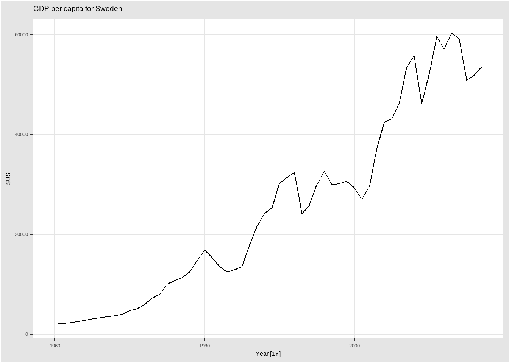

### 모델 정의

예측에 사용할 수 있는 다양한 시계열 모형이 있다. 데이터에 맞는 적절한
시계열 모형을 지정하는 것은 정확한 예측을 수행하는데 필수적이다. 예를
들어, 1인당 GDP에 대한 선형 추세 모형을 다음과 같이 지정할 수 있다.


```r
TSLM(GDP_per_capita ~ trend())
```

이 경우 모형 함수는 `TSLM()`이고, 반응변수는 GDP_per_capita, 설명변수는
`trend()`(선형 추세를 지정하는 함수)이다.

모형의 구조를 정의하는데 사용하는 특정 함수는 모형마다 다르게
정의된다(각 모형이 다른 구조를 지원할 수 있기 때문에). 각 모형에 대한
특정 함수 목록과 설명은 "Special" 챕터에서 볼 수 있다.

### 모델 학습

적절한 모형이 지정되면 일부 데이터에 대해 학습을 진행한다. model()
함수를 이용해서 하나 이상의 모델의 을 적합시킬 수 있다.


```r
fit <- gdppc %>%
  model(trend_model = TSLM(GDP_per_capita ~ trend()))
fit
```

```
#> # A mable: 263 x 2
#> # Key:     Country [263]
#>    Country             trend_model
#>    <fct>                   <model>
#>  1 Afghanistan              <TSLM>
#>  2 Albania                  <TSLM>
#>  3 Algeria                  <TSLM>
#>  4 American Samoa           <TSLM>
#>  5 Andorra                  <TSLM>
#>  6 Angola                   <TSLM>
#>  7 Antigua and Barbuda      <TSLM>
#>  8 Arab World               <TSLM>
#>  9 Argentina                <TSLM>
#> 10 Armenia                  <TSLM>
#> # ... with 253 more rows
```

tsibble의 주요 변수의 각 조합에 대한 1인당 GDP 데이터에 대해서 선형 추세
모형을 적합시킨 것이다. 이 예시에서는 263개 국가 각각에 해당 모형을
적합시킨다. 적합 결과 object는 model table이나 "mable" 형태이다.

각 행은 key 변수 중 하나의 조합에 해당한다. trend_model 열에는 각 국가에
대해 적합시킨 모델에 대한 결과가 포함된다. 마지막 챕터에서 각 모델에
대해 더 많은 정보를 얻는 방법을 익힐 것이다.

### 모델 성능 검증

모델을 적합시킨 후, 데이터에 모델이 얼마나 잘 적합되었는지 확인하는 것이
중요하다. 모델을 검증하기 위한 몇 가지 진단 도구가 있으며, 모델 간
비교를 위한 정확성 측도가 있다. 자세한 내용은 5.8, 5.9 챕터에서
설명한다.

### 예측

적절한 모형을 선택하고, 추정 및 확인을 한후 예측을 할 때 사용하는 것이
`forecast()`이다. 이 함수를 사용하는 가장 쉬운 방법은 예측할 미래 관측치
수를 지정하는 것이다. 예를 들어, 다음 10개의 관측치에 대한 예측값은
`h=10`을 이용해서 생성할 수 있다. 또다른 예시로 2년 후 미래에 대한
예측값은 `h = "2 years"`를 이용해서 생성할 수 있다. 또는 예측할 미래
기간에 해당하는 데이터셋을 사전에 만드는 것이 편리할 수도 있다. 모델에
외생변수와 같은 데이터의 추가 정보를 사용할 때 일반적으로 필요하다.
모델에 필요한 추가적인 데이터는 예측할 관측 데이터셋에 포함될 수 있다.


```r
fit %>% forecast(h = "3 years")
```

```
#> # A fable: 789 x 5 [1Y]
#> # Key:     Country, .model [263]
#>    Country        .model       Year   GDP_per_capita  .mean
#>    <fct>          <chr>       <dbl>           <dist>  <dbl>
#>  1 Afghanistan    trend_model  2018     N(526, 9653)   526.
#>  2 Afghanistan    trend_model  2019     N(534, 9689)   534.
#>  3 Afghanistan    trend_model  2020     N(542, 9727)   542.
#>  4 Albania        trend_model  2018  N(4716, 476419)  4716.
#>  5 Albania        trend_model  2019  N(4867, 481086)  4867.
#>  6 Albania        trend_model  2020  N(5018, 486012)  5018.
#>  7 Algeria        trend_model  2018  N(4410, 643094)  4410.
#>  8 Algeria        trend_model  2019  N(4489, 645311)  4489.
#>  9 Algeria        trend_model  2020  N(4568, 647602)  4568.
#> 10 American Samoa trend_model  2018 N(12491, 652926) 12491.
#> # ... with 779 more rows
```

각 행은 각 국가에 대한 하나의 예측 기간에 해당한다.
`GDP_per_capita`열에는 예측 분포가 포함되고, `.mean`열에는 예측값이
포함된다. 예측값은 예측분포의 평균이다.

과거 데이터를 포함한 예측 시각화는 `autoplot()`을 이용할 수 있다.


```r
fit %>%
  forecast(h = "3 years") %>%
  dplyr::filter(Country == "Sweden") %>%
  autoplot(gdppc) +
  labs(y = "$US", title = "GDP per capita for Sweden")
```

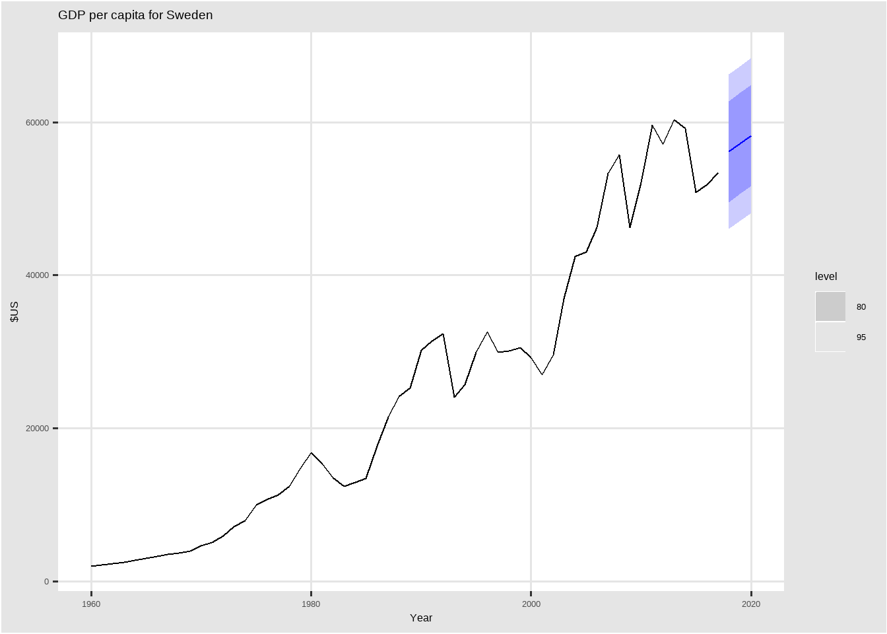

## 몇가지 간단한 예측 방법

일부 예측 방법은 매우 간단하고 효과적이다. 이 책 전체에서 벤치마크로 네
가지 간단한 예측방법을 사용할 것이다. 이를 설명하기 위해 먼저 1970년부터
2004년까지 분기별 호주 벽돌 생산량 데이터를 사용할 것이다.


```r
aus_production
```

```
#> # A tsibble: 218 x 7 [1Q]
#>    Quarter  Beer Tobacco Bricks Cement Electricity   Gas
#>      <qtr> <dbl>   <dbl>  <dbl>  <dbl>       <dbl> <dbl>
#>  1 1956 Q1   284    5225    189    465        3923     5
#>  2 1956 Q2   213    5178    204    532        4436     6
#>  3 1956 Q3   227    5297    208    561        4806     7
#>  4 1956 Q4   308    5681    197    570        4418     6
#>  5 1957 Q1   262    5577    187    529        4339     5
#>  6 1957 Q2   228    5651    214    604        4811     7
#>  7 1957 Q3   236    5317    227    603        5259     7
#>  8 1957 Q4   320    6152    222    582        4735     6
#>  9 1958 Q1   272    5758    199    554        4608     5
#> 10 1958 Q2   233    5641    229    620        5196     7
#> # ... with 208 more rows
```

**filter_index(.data, ...)**

-   .data : tsibble

-   ... : start \~ end 또는 \~ end(. \~ end), start \~ .


```r
bricks <- aus_production %>%
  filter_index("1970 Q1" ~ "2004 Q4") %>%
  select(Bricks)

bricks
```

```
#> # A tsibble: 140 x 2 [1Q]
#>    Bricks Quarter
#>     <dbl>   <qtr>
#>  1    386 1970 Q1
#>  2    428 1970 Q2
#>  3    434 1970 Q3
#>  4    417 1970 Q4
#>  5    385 1971 Q1
#>  6    433 1971 Q2
#>  7    453 1971 Q3
#>  8    436 1971 Q4
#>  9    399 1972 Q1
#> 10    461 1972 Q2
#> # ... with 130 more rows
```

### Mean method

Mean method에서 모든 미래 관측치에 대한 예측은 과거 데이터의 평균과
같다. 과거 데이터를 $y_1, \cdots, y_T$로 표기한다면, 미래 예측치는
다음과 같이 표현할 수 있다.

$$
\hat{y}_{T+h|T} = \bar{y} = (y_1, \cdots y_T)/T
$$ $\hat{y}_{T+h|T}$는 $y_1, \cdots, y_T$를 이용한 $y_{T+h}$의
추정치이다.


```r
bricks %>% model(MEAN(Bricks)) %>% report()
```

```
#> Series: Bricks 
#> Model: MEAN 
#> 
#> Mean: 450.8786 
#> sigma^2: 3993.2441
```

### Naive method

Naive method에서 모든 미래 관측치에 대한 예측은 마지막 관측치 값과 같다.
즉 다음과 같이 표현할 수 있다.

$$
\hat{y}_{T+h|T} = y_T
$$


```r
bricks %>% model(NAIVE(Bricks)) %>% report()
```

```
#> Series: Bricks 
#> Model: NAIVE 
#> 
#> sigma^2: 1974.3053
```

### Seasonal naive method

Seasonal naive method는 Naive method와 유사한 방법으로 계절성이 높은
데이터에 유용하다. Seasonal naive method에서 모든 미래 관측치에 대한
예측은 같은 시즌(예시. 전년도 같은달)의 마지막 관측값으로 한다.

$$
\hat{y}_{T+h|T} = y_{T+h-m(k+1)}
$$ 여기서, $m$은 seasonal period이고, $k$는 $(h-1)/m$의 정수값이다. 예를
들어 월별 데이터에서, 모든 2월에 대한 예측값은 작년 2월의 값으로 한다.


```r
bricks %>% model(SNAIVE(Bricks ~ lag("year"))) %>% 
  forecast(h = "5 years") %>% head()
```

```
#> # A fable: 6 x 4 [1Q]
#> # Key:     .model [1]
#>   .model                           Quarter       Bricks .mean
#>   <chr>                              <qtr>       <dist> <dbl>
#> 1 "SNAIVE(Bricks ~ lag(\"year\"))" 2005 Q1 N(409, 3026)   409
#> 2 "SNAIVE(Bricks ~ lag(\"year\"))" 2005 Q2 N(423, 3026)   423
#> 3 "SNAIVE(Bricks ~ lag(\"year\"))" 2005 Q3 N(428, 3026)   428
#> 4 "SNAIVE(Bricks ~ lag(\"year\"))" 2005 Q4 N(397, 3026)   397
#> 5 "SNAIVE(Bricks ~ lag(\"year\"))" 2006 Q1 N(409, 6053)   409
#> 6 "SNAIVE(Bricks ~ lag(\"year\"))" 2006 Q2 N(423, 6053)   423
```

### Drift method

naive method의 변형은 시간이 지남에 따라 예측값이 증가하거나 감소하는
것이다. 여기서 시간에 따른 변화량(drift)는 과거 시점의 평균 변화의
집합이다. 따라서 미래 $T+h$ 예측치는 다음과 같이 표현할 수 있다.

$$
\hat{y}_{T+h|T} = y_T + \frac{h}{T-1} \sum_{t = 2}^T (y_t - y_{t-1}) = y_T + h(\frac{y_T - y_1}{T-1})
$$

이는 첫 번째와 마지막 관측치 사이의 직선을 이용해서 예측하는 것과 동일하다.


```r
bricks %>% model(RW(Bricks ~ drift())) %>% report()
```

```
#> Series: Bricks 
#> Model: RW w/ drift 
#> 
#> Drift: 0.0791 (se: 3.7688)
#> sigma^2: 1974.3053
```


```r
# aus_production from 1992 to 2010
# Set training data from 1992 to 2006
train <- aus_production %>%
  filter_index("1992 Q1" ~ "2006 Q4")
# Fit the models
beer_fit <- train %>%
  model(
    Mean = MEAN(Beer),
    `Naïve` = NAIVE(Beer),
    `Seasonal naïve` = SNAIVE(Beer)
  )
beer_fit
```

```
#> # A mable: 1 x 3
#>      Mean   Naive `Seasonal naive`
#>   <model> <model>          <model>
#> 1  <MEAN> <NAIVE>         <SNAIVE>
```


```r
# Generate forecasts for 14 quarters
beer_fc <- beer_fit %>% forecast(h = 14)
beer_fc
```

```
#> # A fable: 42 x 4 [1Q]
#> # Key:     .model [3]
#>    .model Quarter         Beer .mean
#>    <chr>    <qtr>       <dist> <dbl>
#>  1 Mean   2007 Q1 N(436, 1996)  436.
#>  2 Mean   2007 Q2 N(436, 1996)  436.
#>  3 Mean   2007 Q3 N(436, 1996)  436.
#>  4 Mean   2007 Q4 N(436, 1996)  436.
#>  5 Mean   2008 Q1 N(436, 1996)  436.
#>  6 Mean   2008 Q2 N(436, 1996)  436.
#>  7 Mean   2008 Q3 N(436, 1996)  436.
#>  8 Mean   2008 Q4 N(436, 1996)  436.
#>  9 Mean   2009 Q1 N(436, 1996)  436.
#> 10 Mean   2009 Q2 N(436, 1996)  436.
#> # ... with 32 more rows
```


```r
beer_fc %>%
  autoplot(train, level = NULL) + # level = NULL : 예측구간 x
  autolayer(
    filter_index(aus_production, "2007 Q1" ~ .),
    colour = "black"
  ) +
  labs(
    y = "Megalitres",
    title = "Forecasts for quarterly beer production"
  ) +
  guides(colour = guide_legend(title = "Forecast"))
```

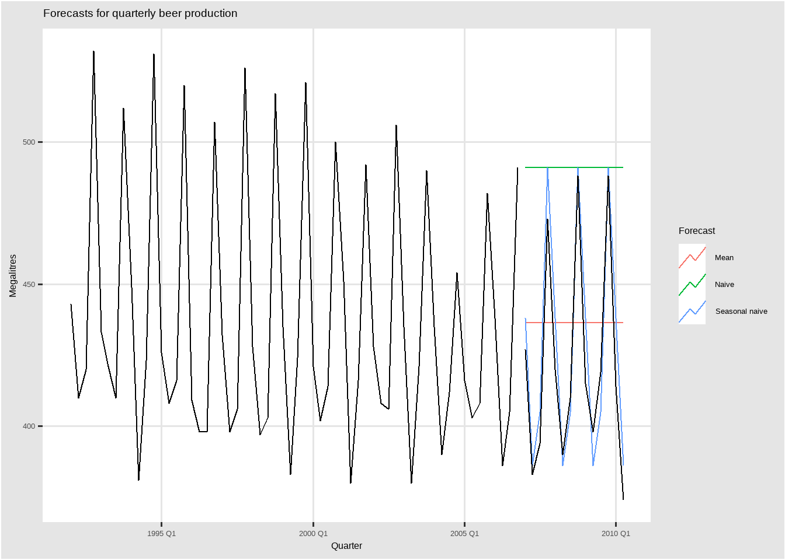

## fitted value and residuals

### fitted value 

시계열의 각 관찰값은 모든 이전 시점 관찰값을 이용해서 예측할 수 있습니다. 이를 적합값(fitted value)으로 표현하며, 기호로는 $\hat{y}_{t|t-1}$로 표기한다. 아래첨자를 생략하고 $\hat{y}_{t|t-1}$ 대신에 $\hat{y}_t$로 표기할 수도 있다. 적합값은 대부분 한단계 예측치(one-step forecast)를 포함한다. 

사실, 적합값은 미래 예측값을 포함하여, 사용할 수 있는 모든 관측값으로 예측 기법에 들어가는 매개변수를 추정했기 때문에 진짜 예측값이 아니다. 예를 들어, mean method를 이용했을 때 적합값은 다음과 같다. 

$$
\hat{y}_t = \hat{c}
$$
$\hat{c}$는 $t$ 시점 이후 관측값을 포함하여 이용가능한 모든 관측값에 대한 평균이다. 유사하게, 표류 기법(drift method)에서는 표류 매개변수는 모든 이용가능한 관측값을 이용해서 추정된다. 이 경우에, 적합값은 다음과 같다. 
$$
\hat{y}_t = y_{t-1} + \hat{c}, \, \hat{c} = \frac{y_T - y_1}{T-1}
$$
두 경우 모두, 데이터를 이용해서 추정한 매개변수가 있다. $\hat{c}$에 $t$ 시점 이후의 관측치가 포함될 때, 적합값은 진짜 예측치가 아니다. 반면에, 나이브 혹은 나이브 계절성 예측에는 어떠한 매개변수도 없기 때문에, 이 경우에는 적합값이 진짜 예측치가 된다.  

### residuals 

시계열 모형에서 잔차는 모델을 적합시킨 후에 남은 것을 의미한다. 즉, 잔차는 관측값과 적합값의 차이로 표현된다. 

$$
e_t = y_t - \hat{y_t}
$$
만약 모형에 변환이 사용된 경우, 변환된 척도에서 잔차를 확인하는 것이 유용할 수 있다. 이것을 주로 **"innovation residuals"**라고 부른다. 예를 들어, 데이터에 로그변환을 했다고 가정했을 때($w_t = log(y_t)$), innovation residuals은 $w_t - \hat{w_t}$로 표기할 수 있고, 반면에 regular residuals는 $y_t - \hat{y}_t$로 표기할 수 있다. 변환을 수행하지 않았다면 innovation residuals와 regular residuals는 동일하며, 이 경우 우리는 단순하게 "residuals"라고 표기한다. 

모델로부터 적합값과 잔차는 `augument()` 함수를 이용해서 구할 수 있다. 섹션 5.2 맥주 생산량 예시에서, 우리는 `beer_fit`으로 적합시킨 모형을 저장했다. 그래서 단순하게 `augument()`를 이용해서 모든 모형에 대한 적합값과 잔차를 계산할 수 있다. 


```r
augment(beer_fit)
```

```
#> # A tsibble: 180 x 6 [1Q]
#> # Key:       .model [3]
#>    .model Quarter  Beer .fitted .resid .innov
#>    <chr>    <qtr> <dbl>   <dbl>  <dbl>  <dbl>
#>  1 Mean   1992 Q1   443    436.   6.55   6.55
#>  2 Mean   1992 Q2   410    436. -26.4  -26.4 
#>  3 Mean   1992 Q3   420    436. -16.4  -16.4 
#>  4 Mean   1992 Q4   532    436.  95.6   95.6 
#>  5 Mean   1993 Q1   433    436.  -3.45  -3.45
#>  6 Mean   1993 Q2   421    436. -15.4  -15.4 
#>  7 Mean   1993 Q3   410    436. -26.4  -26.4 
#>  8 Mean   1993 Q4   512    436.  75.6   75.6 
#>  9 Mean   1994 Q1   449    436.  12.6   12.6 
#> 10 Mean   1994 Q2   381    436. -55.4  -55.4 
#> # ... with 170 more rows
```

원본 데이터에 새롭게 3개의 열에 추가되었다. 

-   `.fitted` : 적합값을 의미함

-   `.resid` : 잔차를 의미함 

-   `.innov` : "innovation residuals"를 의미함(현재 예시에서는 변환을 하지 않았기 때문에 regular residuals와 동일함)

잔차는 모형이 데이터의 정보를 적절하게 잡아냈는지 여부를 확인하는데 유용하다. 이를 위해, "innovation residuals"를 이용한다. "innovation residuals"에서 패턴이 존재할 경우, 해당 모형은 개선이 필요하다. 다음 섹션에서 잔차의 패턴을 탐색하기 위한 도구들을 살펴본다.  


## Residuals diagnistics 

좋은 예측 방법은 다음과 같은 특성을 갖는 "innovation residuals"을 산출합니다. 


1. "innovation residuals" 사이에 상관관계가 없다. "innovation residuals" 사이에 상관관계가 있다면, 잔차에는 예측값을 계산할 때 사용해야 하는 정보가 남아있다는 것을 의미한다. 

2. "innovation residuals"의 평균이 0이다. 잔차의 평균이 0이 아닐 경우, 예측값이 편향되었음을 의미한다. 

이러한 특성을 만족하지 않는 모든 예측 방법은 개선될 수 있다. 그러나 이 말이 이러한 특성을 만족하는 예측 방법이 개선될 수 없다는 것은 아니다. 동일한 데이터에 대해 이러한 특성을 만족하는 여러가지 다양한 예측 방법을 사용할 수 있다. 이러한 특성을 확인하는 것은 어떤 모델이 사용할 수 있는 모든 정보를 사용했는지 여부를 확인하기 위해 중요한 것이지만, 예측 방법을 선택하는데 좋은 방법은 아니다.

이러한 특성 중 하나라도 만족되지 않는다면, 예측 방법을 수정해서 더 나은 예측을 제공할 수 있다. 편향을 보정하는 것은 쉽다: 잔차의 평균이 $m$일 경우, 단순하게 모든 예측치에 $m$을 뺌으로서, 편향을 보정할 수 있다. 상관(correlation) 문제를 개선하는 것은 어렵고, 챕터 10까지 관련 내용은 다루지 않을 것이다. 

이러한 핵심 특성뿐만 아니라 (필수적이지않지만) 다음과 같은 잔차의 두 가지 특성도 유용할 수 있다. 

3.  "innovation residuals"의 분산이 상수이다. 이는 등분산성을 의미한다.

4. "innovation residuals"가 정규분포를 따른다. 

추가적인 두 가지 특성은 예측 구간을 쉽게 계산할 수 있게 만든다(섹션 5.5의 예시 참고). 그러나 이러한 특성을 만족하지 않는 예측 방법을 반드시 개선할 수 있는 것은 아니다. 보통 박스-콕스 변환은 이러한 특성을 만족시키기 위해 도움이 될 수 있지만, 일반적으로 등분산성과 정규성을 만족하기 위해 할 수 있는 것은 거의 없다. 대신에, 예측 구간을 얻기 위한 대안적인 접근이 필요하다. 섹션 5.5에 정규성을 만족하지 않는 "innovation residuals"을 다루는 방법에 대해 알아본다. 

## 예 : 구글 일일 종가 예측 

주식시장 가격과 지수의 경우, 가장 좋은 예측 방법은 주로 `naive method`이다. 즉, 각 예측값은 단순하게 마지막 관측치 값과 동일하다. ($\hat{y}_t = y_{t-1}$). 따라서, 잔차는 단순하게 인접 관측치 사이의 차이와 동일하다.

$$
e_t = y_t - \hat{y}_t = y_t - y_{t-1}
$$
다음 그래프는 2015년의 구글 일일 종가의 추이를 보여준다. 가장 큰 폭의 상승은 2015년 7월 17일에 해당하며, 예상치 못한 2분기 실적으로 인해 16& 상승했다.  


```r
gafa_stock
```

```
#> # A tsibble: 5,032 x 8 [!]
#> # Key:       Symbol [4]
#>    Symbol Date        Open  High   Low Close Adj_Close    Volume
#>    <chr>  <date>     <dbl> <dbl> <dbl> <dbl>     <dbl>     <dbl>
#>  1 AAPL   2014-01-02  79.4  79.6  78.9  79.0      67.0  58671200
#>  2 AAPL   2014-01-03  79.0  79.1  77.2  77.3      65.5  98116900
#>  3 AAPL   2014-01-06  76.8  78.1  76.2  77.7      65.9 103152700
#>  4 AAPL   2014-01-07  77.8  78.0  76.8  77.1      65.4  79302300
#>  5 AAPL   2014-01-08  77.0  77.9  77.0  77.6      65.8  64632400
#>  6 AAPL   2014-01-09  78.1  78.1  76.5  76.6      65.0  69787200
#>  7 AAPL   2014-01-10  77.1  77.3  75.9  76.1      64.5  76244000
#>  8 AAPL   2014-01-13  75.7  77.5  75.7  76.5      64.9  94623200
#>  9 AAPL   2014-01-14  76.9  78.1  76.8  78.1      66.1  83140400
#> 10 AAPL   2014-01-15  79.1  80.0  78.8  79.6      67.5  97909700
#> # ... with 5,022 more rows
```


```r
google_stock <- gafa_stock %>%
  dplyr::filter(Symbol == "GOOG", year(Date) >= 2015) %>%
  mutate(day = row_number()) %>%
  update_tsibble(index = day, regular = TRUE)
# Filter the year of interest
google_2015 <- google_stock %>% 
  dplyr::filter(year(Date) == 2015)
google_2015
```

```
#> # A tsibble: 252 x 9 [1]
#> # Key:       Symbol [1]
#>    Symbol Date        Open  High   Low Close Adj_Close  Volume   day
#>    <chr>  <date>     <dbl> <dbl> <dbl> <dbl>     <dbl>   <dbl> <int>
#>  1 GOOG   2015-01-02  526.  528.  521.  522.      522. 1447600     1
#>  2 GOOG   2015-01-05  520.  521.  510.  511.      511. 2059800     2
#>  3 GOOG   2015-01-06  512.  513.  498.  499.      499. 2899900     3
#>  4 GOOG   2015-01-07  504.  504.  497.  498.      498. 2065100     4
#>  5 GOOG   2015-01-08  495.  501.  488.  500.      500. 3353600     5
#>  6 GOOG   2015-01-09  502.  502.  492.  493.      493. 2069400     6
#>  7 GOOG   2015-01-12  492.  493.  485.  490.      490. 2322400     7
#>  8 GOOG   2015-01-13  496.  500.  490.  493.      493. 2370500     8
#>  9 GOOG   2015-01-14  492.  500.  490.  498.      498. 2235700     9
#> 10 GOOG   2015-01-15  503.  503.  495.  499.      499. 2715800    10
#> # ... with 242 more rows
```


```r
autoplot(google_2015, Close) +
  labs(y = "$US",
       title = "Google daily closing stock prices in 2015")
```

<div class="figure">
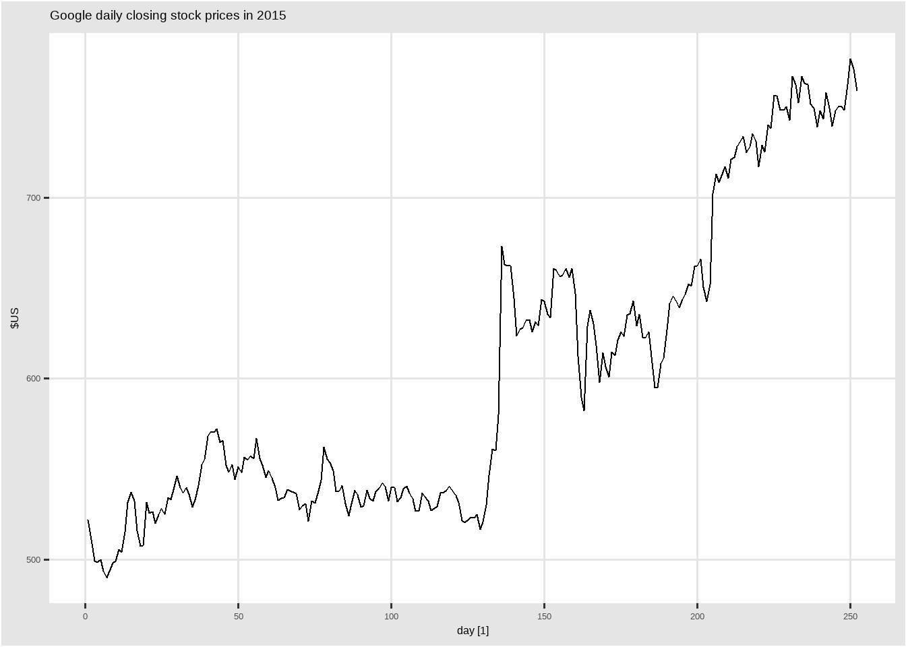
<p class="caption">(\#fig:fig5-9)2015년 일자별 구글 주가</p>
</div>

`naive method`를 이용해서 얻은 잔차 그림은 아래 그림과 같다. 큰 양의 잔차는 7월의 예상치 못한 가격 상승의 결과이다. 


```r
aug <- google_2015 %>%
  model(NAIVE(Close)) %>%
  augment()
autoplot(aug, .innov) +
  labs(y = "$US",
       title = "Residuals from the naïve method")
```

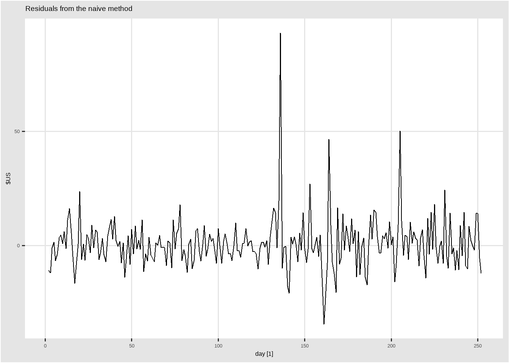


```r
aug %>%
  ggplot(aes(x = .innov)) +
  geom_histogram() +
  labs(title = "Histogram of residuals")
```

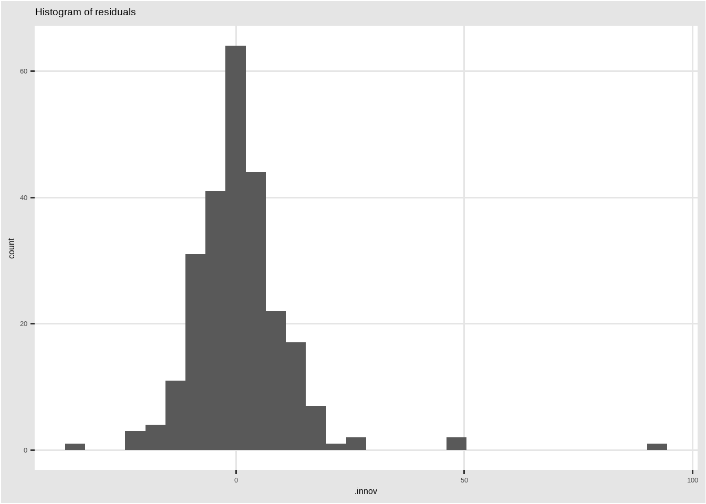


```r
aug %>%
  ACF(.innov) %>%
  autoplot() +
  labs(title = "Residuals from the naïve method")
```

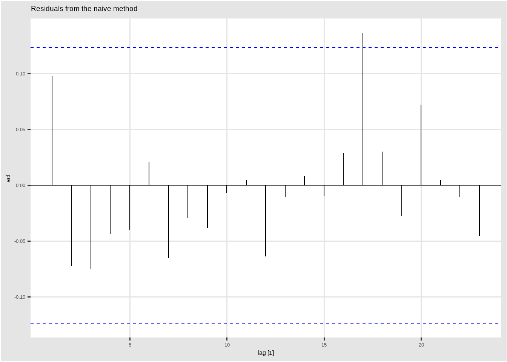


이 그래프는 `naïve method`을 이용해서 사용할 수 있는 모든 정보를 설명한 것처럼 보이는 예측을 생성한다는 것을 보여준다. 잔차의 평균은 0에 가깝고, 잔차 사이에는 유의미한 상관관계가 없다. 잔차의 시간 그래프는 하나의 이상치를 제외하고 잔차의 변동이 과거와 동일하게 유지되는 것을 보여준다. 이러한 특징은 잔차의 히스토그램에서도 볼수 있다. 히스토그램은 잔차가 정규성을 만족하지 않는 것처럼 보인다. 이상치를 무시하더라고, 오른쪽으로 긴 꼬리를 갖는 분포로 보인다. 결과적으로, `naïve method`는 꽤 좋은 예측치를 제공하지만, 정규분포를 가정한 예측 구간에서는 부정확할 수 있다. 


이러한 잔차 진단 그래프를 생성하기 위한 더 간단한 방법은 `gg_tsresiduals()`이다. `gg_tsresiduals()`는 잔차의 시간 그래프, ACF 그래프, 잔차의 히스토그램을 생성한다. 

```r
google_2015 %>%
  model(NAIVE(Close)) %>%
  gg_tsresiduals()
```

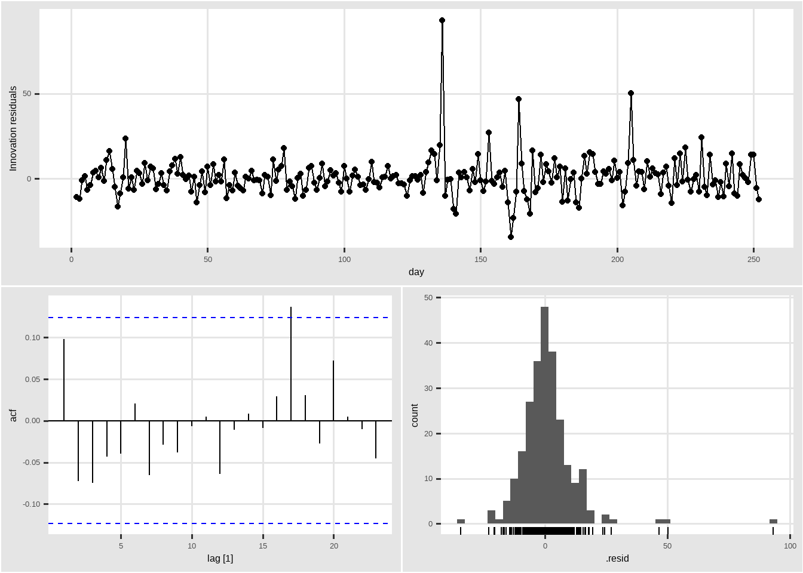


## 자기상관에 대한 포트맨토 검정 

ACF 그래프를 확인하는 것뿐만 아니라, $r_k$을 개별적으로 다루는 것 대신 $r_k$의 전체 집합을 하나의 그룹으로 생각하여 자기 상관에 대한 검정을 할 수 있다. $r_k$가 lag $k$의 자기상관이라는 것을 상기하자. 

ACF 그래프에서 각 막대가 신뢰구간 안에 포함되는지를 볼 때, 우리는 암시적으로 다중 검정을 수행하고 있으며, 각 검정은 False Positive를 줄 가능성이 적다. 이러한 검정이 충분히 완료되면, 적어도 하나는 False Positive를 제공할 가능성이 높으므로, 실제로 그렇지 않은 경우에도 잔차에 자기상관이 남아있다고 결론을 내릴 수 있다. 

이러한 문제를 해결하기 위해, 처음 $l$개의 자기상관이 백색잡음과정에서 얻은 것과 다른지 여부를 검정한다. 자기상관 값의 그룹에 대한 검정을 여러가지 물품을 담고 있는 여행 가방이라는 프랑스 단어를 빌려 포트맨토 검정이라 한다. 

이러한 검정 중에 하나를 **Box-Pierce 검정**이라 하며, 검정통계량은 다음과 같다. 

$$
Q = T \sum_{k=1}^l r_k^2, 
$$

$l$은 최대 시차를 의미하며, $T$는 관측값의 수를 의미한다. 만약 $r_k$가 0에 가깝다면, $Q$는 작아질 것이다. 만약 $r_k$가 크다면, $Q$는 커질 것이다. 우리는 비계절형 데이터의 경우 $l = 10$으로 제안하며, 계절형 데이터의 경우  $l = 2m$으로 제안한다. 이 때, $m$은 계절 주기를 의미한다. 그러나 $l$이 클 때 검정결과가 좋지 않으므로, 이러한 값들이 $T/5$보다 크다면, $l = T/5$를 사용할 것을 권장한다.  

관련된 다른 검정 방법은 (더 정확한)**Ljung-Box 검정**이다. 포트맨토 검정의 경우 $T$가 작을 경우 $Q$가 작아지므로, 실제로는 모형이 적합하지 않은데도 모형이 잘 적합되는 것으로 판정하는 경향이 있다. Ljung and box(1978)은 이를 보완하여 다음과 같은 검정통계량을 제안했다. 

$$
Q^{*} = T(T+2) \sum_{k=1}^l (T-k)^{-1}r_k^2.
$$

$Q^{*}$이 클 경우 자기상관이 백색잡음과정에서 나오지 않았음을 제안한다. 


얼마나 커야 하는가? 만약 자기상관이 백색잡음과정에서 나왔다면, $Q$와 $Q^{*}$는 자유도가 $(l-k)$인 카이제곱분포를 따르며, $K$는 모형의 모수의 개수이다. 만약 원본 데이터에서 이를 계산한다면 $K=0$으로 둔다. 

구글 일일 종가 예측 예시에서는 `naïve method`를 이용하므로, $K=0$으로 둔다. 다음 코드에서 `lag` = $l$, `dof` = $K$이다. 


```r
aug %>% features(.innov, box_pierce, lag = 10, dof = 0)
```

```
#> # A tibble: 1 x 4
#>   Symbol .model       bp_stat bp_pvalue
#>   <chr>  <chr>          <dbl>     <dbl>
#> 1 GOOG   NAIVE(Close)    7.74     0.654
```

```r
aug %>% features(.innov, ljung_box, lag = 10, dof = 0)
```

```
#> # A tibble: 1 x 4
#>   Symbol .model       lb_stat lb_pvalue
#>   <chr>  <chr>          <dbl>     <dbl>
#> 1 GOOG   NAIVE(Close)    7.91     0.637
```

$Q$, $Q^{*}$ 둘 다, 유의하지 않다(즉, p-value가 상대적으로 크다). 따라서 우리는 잔차가 백색잡음과정과 다르지 않다고 결론지을 수 있다.  

구글 일일 종가를 예측하는데 적합할 수 있는 대안은 `drift method`입니다. `tidy()`함수는 과거 데이터에서 관찰된 일일 평균 변화를 측정하는 하나의 매개변수인 표류 계수(drift coefficient)를 보여준다. 

v  

```r
fit <- google_2015 %>% model(RW(Close ~ drift()))
tidy(fit)
```

```
#> # A tibble: 1 x 7
#>   Symbol .model              term  estimate std.error statistic p.value
#>   <chr>  <chr>               <chr>    <dbl>     <dbl>     <dbl>   <dbl>
#> 1 GOOG   RW(Close ~ drift()) b        0.944     0.705      1.34   0.182
```

**Ljung-Box 검정**을 수행할 때, 추정된 매개변수를 설명하기 위해 $K=1$로 설정할 수 있다. 


```r
augment(fit) %>% features(.innov, ljung_box, lag=10, dof=1)
```

```
#> # A tibble: 1 x 4
#>   Symbol .model              lb_stat lb_pvalue
#>   <chr>  <chr>                 <dbl>     <dbl>
#> 1 GOOG   RW(Close ~ drift())    7.91     0.543
```

`naïve method`와 동일하게, `drift method`의 잔차는 백색잡음과정과 다르지 않다고 결론지을 수 있다. 


## 예측값의 분포와 예측 구간 (Distributional forecasts and prediction intervals) {#sect5-5}

### 예측값의 분포 {#sect5-5-1}

제[1.7](#sect1-7)절에서 논의한 바와 같이 우리는 확률 분포를 사용한 우리의 예측값의 불확실성을 표현한다. 그 불확실성은 적합된 모델을 사용하여 가능한 미래의 값을 관측할 확률을 보여준다. 점 예측값은 이 분포의 평균이다. 대부분의 시계열 모델은 정규적으로 분포된 예측값을 만들어낸다. 즉, 우리는 가능한 미래의 값들의 분포가 정규 분포를 따를 것이라고 가정한다. 이 절 뒷부분에서 정규분포의 대안이라고 할 수 있는 분포들을 살펴볼 것이다.

### 예측 구간 {#sect5-5-2}

예측 구간은 우리가 기대하는 특정한 확률에 놓인 $y_t$가 놓일 구간을 의미한다. 예를 들어, 미래의 관측치들의 분포가 정규성을 가질 것이라는, $h$-단계 예측값에 대한 95%의 예측구간은 다음과 같이 나타낼 수 있다.

$$
\hat y_{T+h|T} \pm 1.96\hat\sigma_h,
$$

여기서 $\hat \sigma_h$는 $h$-단계의 예측 분포에 대한 표준편차의 추정치이다.

보다 일반적으로, 예측구간은 다음과 같이 쓸 수도 있다.

$$
\hat y_{T+h|T} \pm c\hat\sigma_h,
$$

여기서 $\hat \sigma_h$ 앞에 있는 $c$는 예측 구간이 나타내고자 하는 확률에 따라 다르다. 이 책에서 우리는 대개 80% 구간과 95% 구간을 계산하지만 다른 확률 역시도 사용될 수 있다. Table \@ref(tab:table5-1)는 정규 예측 분포를 가정한 확률의 범위 $c$의 값을 제시한다.

<table class=" lightable-minimal" style='font-family: "Trebuchet MS", verdana, sans-serif; margin-left: auto; margin-right: auto;'>
<caption>(\#tab:table5-1)Multipliers to be used for prediction intervals</caption>
 <thead>
  <tr>
   <th style="text-align:right;"> Percentage </th>
   <th style="text-align:right;"> Multiplier </th>
  </tr>
 </thead>
<tbody>
  <tr>
   <td style="text-align:right;"> 50 </td>
   <td style="text-align:right;"> 0.67 </td>
  </tr>
  <tr>
   <td style="text-align:right;"> 55 </td>
   <td style="text-align:right;"> 0.76 </td>
  </tr>
  <tr>
   <td style="text-align:right;"> 60 </td>
   <td style="text-align:right;"> 0.84 </td>
  </tr>
  <tr>
   <td style="text-align:right;"> 65 </td>
   <td style="text-align:right;"> 0.93 </td>
  </tr>
  <tr>
   <td style="text-align:right;"> 70 </td>
   <td style="text-align:right;"> 1.04 </td>
  </tr>
  <tr>
   <td style="text-align:right;"> 75 </td>
   <td style="text-align:right;"> 1.15 </td>
  </tr>
  <tr>
   <td style="text-align:right;"> 80 </td>
   <td style="text-align:right;"> 1.28 </td>
  </tr>
  <tr>
   <td style="text-align:right;"> 85 </td>
   <td style="text-align:right;"> 1.44 </td>
  </tr>
  <tr>
   <td style="text-align:right;"> 90 </td>
   <td style="text-align:right;"> 1.64 </td>
  </tr>
  <tr>
   <td style="text-align:right;"> 95 </td>
   <td style="text-align:right;"> 1.96 </td>
  </tr>
  <tr>
   <td style="text-align:right;"> 96 </td>
   <td style="text-align:right;"> 2.05 </td>
  </tr>
  <tr>
   <td style="text-align:right;"> 97 </td>
   <td style="text-align:right;"> 2.17 </td>
  </tr>
  <tr>
   <td style="text-align:right;"> 98 </td>
   <td style="text-align:right;"> 2.33 </td>
  </tr>
  <tr>
   <td style="text-align:right;"> 99 </td>
   <td style="text-align:right;"> 2.58 </td>
  </tr>
</tbody>
</table>

예측 구간의 값은 예측값의 불확실성을 표현한다. 만약 우리가 점 예측값만을 산출한다면, 얼마나 그 예측값이 정확한지에 대해서는 알 수가 없다. 그러나 만약 우리가 예측 구간도 산출한다면, 각 예측값과 관련된 불확실성의 정도에 대해 명백하게 나타낼 수 있게 된다. 이러한 이유에서 점 예측치는 예측 구간과 함께 나타내지 않으면 아무 것도 아닌 값이라고 할 수 있다.

### 한 단계 예측 구간 (One-step prediction intervals) {#sect5-5-3}

한 단계를 앞서 예측하고자 할 때, 예측분포의 표준편차는 다음과 같이 잔차의 표준편차를 사용해서 추정할 수 있다.

$$
\hat \sigma = \sqrt{\frac{1}{T-K}\sum^{T}_{t=1}e^2_t}, (\#eq:eq5-1)
$$

$K$는 예측 방법에서 추정된 모수의 개수를 의미한다.

예를 들어, 구글 주가 데이터 `google_2015`에 대한 단순 예측을 고려해보자. 관측된 계열의 마지막 값은 758.88이므로 그 다음 가격 값에 대한 예측값은 758.88이 된다. 단순 방법으로부터 얻은 잔차의 표준편차는 주어진 공식 \@ref(eq:eq5-1)에 따라 11.19가 된다. 나아가 GSP의 다음 값에 대한 95% 예측 구간은 다음과 같다.

$$
758.88\pm 1.96(11.19) = [736.9, 780.8].
$$

마찬가지로 80% 예측구간은 다음과 같이 구할 수 있다.

$$
758.88\pm 1.28(11.19) = [744.5, 773.2].
$$

1.96 또는 1.28이라는 승수의 값은 표 \@ref(tab:table5-1)에서 확인할 수 있다.


### 다단계 예측 구간 {#sect5-5-4}

예측 구간의 가장 공통적인 특징은 예측 구간이 대개 예측 범위(forecast horizon)가 증가할수록 구간의 길이가 증가한다는 것이다.

+ 예측 범위(forecast horizon): 예측값을 구하고자 하는 미래 시간의 길이를 의미한다. 즉, 3개월 뒤를 예측할 것인지 10년 뒤를 예측할 것인지에 따라 예측 구간의 길이가 달라질 수 있다는 것이다. 10년 뒤를 예측하고자 할 경우, 불확실성이 더 클테니 예측 구간이 더 넓어질 것이다.

우리가 더 멀리 예측하고자 할수록, 예측과 관련된 불확실성은 더 심화되며, 나아가 예측 구간은 더 넓어진다. 즉, $\sigma_h$는 대개 $h$에 따라서 증가한다 (이러한 특성을 가지지 않는 비선형 예측 방법도 존재한다).

예측 구간을 산출하기 위해서는 $\sigma_h$에 대한 추정치를 가져야만 한다. 이미 말했다시피, 한 단계 예측 ($h=1$), 공식 \@ref(eq:eq5-1)는 예측값의 표준편차인 $\sigma_1$에 대한 좋은 추정치를 제공한다. 다단계 예측에 대해서는 보다 복잡한 계산 방법이 요구된다. 이러한 계산방법들은 잔차가 서로 상관하지 않을 것을 가정한다.

### 벤치마크 방법 (Benchmark methods) {#sect5-5-5}

네 가지 벤치마크할 방법들에 대해서, 수학적으로 잔차의 독립성 가정에 바탕하여 예측값의 표준편차를 수리적으로 유도하는 것이 가능하다. 만약 $\hat \sigma_h$가 $h$-단계의 예측 분포에 대한 표준편차를 나타낸다면, $\hat \sigma$는 \@ref(eq:eq5-1)에서 계산하는 잔차의 표준편차를 의미하며 우리는 Table \@ref(tab:table5-2)에서의 표현을 사용할 수 있다. $h=1$이고 $T$가 클 경우에는 값들이 $\hat \sigma$에 근사한다.

<table class=" lightable-minimal" style='font-family: "Trebuchet MS", verdana, sans-serif; margin-left: auto; margin-right: auto;'>
<caption>(\#tab:table5-2)Multi-step forecast standard deviation for the four benchmark methods, where \sigma is the residual standard deviation, m is the seasonal period, and k is the integer part of (h-1)/m (i.e., the number of complete years in the forecast period prior to time T + h).</caption>
 <thead>
  <tr>
   <th style="text-align:left;"> Benchmark method </th>
   <th style="text-align:left;"> h-step forecast standard deviation </th>
  </tr>
 </thead>
<tbody>
  <tr>
   <td style="text-align:left;"> 평균 </td>
   <td style="text-align:left;"> $\hat \sigma_{h} = \hat \sigma \sqrt{1+1/T}$ </td>
  </tr>
  <tr>
   <td style="text-align:left;"> 단순 </td>
   <td style="text-align:left;"> $\hat \sigma_{h} = \hat \sigma \sqrt{h}$ </td>
  </tr>
  <tr>
   <td style="text-align:left;"> 계절성 단순 </td>
   <td style="text-align:left;"> $\hat \sigma_{h} = \hat \sigma \sqrt{k+1}$ </td>
  </tr>
  <tr>
   <td style="text-align:left;"> 표류 </td>
   <td style="text-align:left;"> $\hat \sigma_{h} = \hat \sigma \sqrt{h(1+h/T)}$ </td>
  </tr>
</tbody>
</table>

예측 구간은 `fable` 패키지를 사용하면 쉽게 계산할 수 있다. 예를 들어, 단순 방법을 사용해서 구글 주가를 계산한 결과의 예측 구간을 구해보자.


```r
google_2015 %>%
  model(NAIVE(Close)) %>%
  forecast(h = 10) %>%
  hilo()
```

```
#> # A tsibble: 10 x 7 [1]
#> # Key:       Symbol, .model [1]
#>    Symbol .model         day        Close .mean                  `80%`
#>    <chr>  <chr>        <dbl>       <dist> <dbl>                 <hilo>
#>  1 GOOG   NAIVE(Close)   253  N(759, 125)  759. [744.5400, 773.2200]80
#>  2 GOOG   NAIVE(Close)   254  N(759, 250)  759. [738.6001, 779.1599]80
#>  3 GOOG   NAIVE(Close)   255  N(759, 376)  759. [734.0423, 783.7177]80
#>  4 GOOG   NAIVE(Close)   256  N(759, 501)  759. [730.1999, 787.5601]80
#>  5 GOOG   NAIVE(Close)   257  N(759, 626)  759. [726.8147, 790.9453]80
#>  6 GOOG   NAIVE(Close)   258  N(759, 751)  759. [723.7543, 794.0058]80
#>  7 GOOG   NAIVE(Close)   259  N(759, 876)  759. [720.9399, 796.8202]80
#>  8 GOOG   NAIVE(Close)   260 N(759, 1002)  759. [718.3203, 799.4397]80
#>  9 GOOG   NAIVE(Close)   261 N(759, 1127)  759. [715.8599, 801.9001]80
#> 10 GOOG   NAIVE(Close)   262 N(759, 1252)  759. [713.5329, 804.2272]80
#> # ... with 1 more variable: 95% <hilo>
```

`hilo()` 함수는 예측 분포를 구간으로 바꾸어준다. 기본값은 80%와 9% 예측구간을 반환하지만 `level`이라는 옵션을 통해서 다른 값들을 설정할 수 있다.

그래프를 그릴 때, 예측변수는 음영을 통해 구간과 관련된 확률을 색의 농도로 나타낸다. 80%와 95%의 예측 구간을 기본값이며, 다른 값들도 설정가능하다.


```r
google_2015 %>%
  model(NAIVE(Close)) %>%
  forecast(h = 10) %>%
  autoplot(google_2015) +
  labs(title="구글 일별 예측 종가", y = "미국 달러 ($)",
       x = "일")
```

<div class="figure">
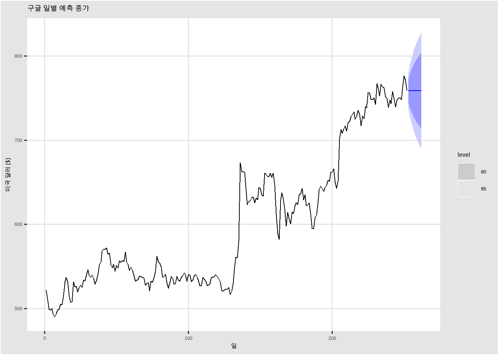
<p class="caption">(\#fig:unnamed-chunk-29)단순 방법에 기초한 구글 종가에 대한 80%와 95% 예측 구간</p>
</div>

### 부트스트랩 잔차를 통한 예측 구간 {#sect5-5-6}

잔차에 대한 정규분포가 합당하지 않은 가정일 경우에, 하나의 대안은 잔차가 서로 상관하지 않으며 균등한 분산을 가진다고만 가정한 상태에서 부트스트래핑을 이용하는 것이다.

한 단계 예측오차는 $e_t = y_t - \hat y_{t|t-1}$로 정의된다. 이는 다음과 같이 다시 쓸 수 있다.

$$
y_t = \hat y_{t|t-1} + e_t.
$$

따라서 우리는 다음과 같은 공식을 사용해서 시계열에 대한 다음 관측치를 시뮬레이션 할 수 있다.

$$
y_{T+1} = \hat y_{T+1|T} + e_{T+1}
$$

이 경우, $\hat y_{T+1|T}$는 한 단계 예측값이며, $e_{T+1}$은 알려지지 않은미래의 오차이다. 미래의 오차가 과거의 오차와 유사하다고 가정하면, $e_{T+1}$를 과거에서 관측된 일련의 오차들(예, 잔차)로부터 표집한 결과로 대체할 수 있다. 새롭게 시뮬레이션된 관측치를 기존의 데이터셋에 추가함으로써, 우리는 다음의 과정을 반복할 수 있다.

$$
y_{T+2} = \hat y_{T+2|T+1} + e_{T+2}
$$

이때, $e_{T+2}$는 일련의 잔차들로부터 추출된 또 다른 결과이다. 이 방법을 지속하면서 우리는 우리가 가진 시계열에 대해 전체 미래의 값들을 시뮬레이션 할 수 있다.

이 과정을 반복하면서 우리는 많은 가능한 미래들을 얻게 된다. 이들 중 일부를 확인하기 위해서 `generate()` 함수를 사용할 수 있다.


```r
fit <- google_2015 %>%
  model(NAIVE(Close))
sim <- fit %>% generate(h = 30, times = 5, bootstrap = TRUE)
sim
```

```
#> # A tsibble: 150 x 5 [1]
#> # Key:       Symbol, .model, .rep [5]
#>    Symbol .model         day .rep   .sim
#>    <chr>  <chr>        <dbl> <chr> <dbl>
#>  1 GOOG   NAIVE(Close)   253 1      751.
#>  2 GOOG   NAIVE(Close)   254 1      757.
#>  3 GOOG   NAIVE(Close)   255 1      753.
#>  4 GOOG   NAIVE(Close)   256 1      745.
#>  5 GOOG   NAIVE(Close)   257 1      745.
#>  6 GOOG   NAIVE(Close)   258 1      753.
#>  7 GOOG   NAIVE(Close)   259 1      750.
#>  8 GOOG   NAIVE(Close)   260 1      754.
#>  9 GOOG   NAIVE(Close)   261 1      750.
#> 10 GOOG   NAIVE(Close)   262 1      750.
#> # ... with 140 more rows
```

여기서 우리는 다음 30일의 주식거래일에 대해 가능한 다섯 개 표본 경로를 산출해냈다. `.rep` 변수는 `tsibble`의 새로운 키를 제공하는 변수이다. 아래는 종단 자료에 대한 다섯 개의 표본 경로를 보여준다.


```r
google_2015 %>%
  ggplot(aes(x = day)) +
  geom_line(aes(y = Close)) +
  geom_line(aes(y = .sim, color = as.factor(.rep)),
    data = sim) +
  scale_color_hue(l = 45) + 
  labs(title="구글 일별 종가", y="미국 달러 ($)", x = "일" ) +
  guides(colour = "none") 
```

<div class="figure">
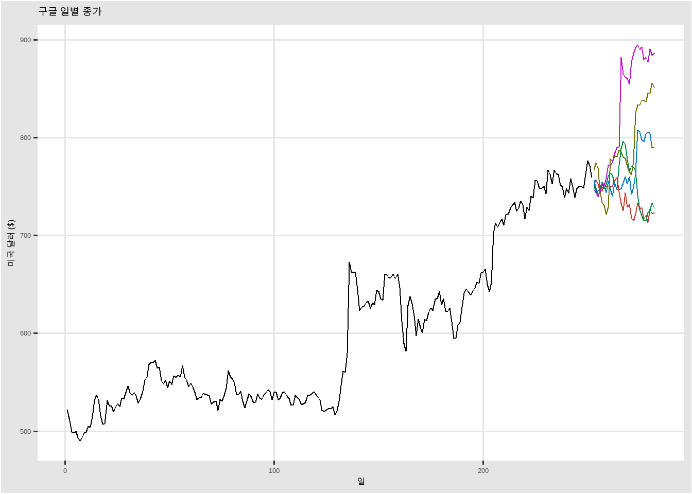
<p class="caption">(\#fig:unnamed-chunk-31)부트스트랩 잔차를 이용한 단순 방법에 기초한 구글 종가의 다섯 가지 시뮬레이션된 미래 표본 경로</p>
</div>

각 예측 범위에 대해 미래 표본 경로의 분위를 계산함으로써 예측 구간을 산출할 수 있다. 그 결과는 **부트스트랩된** 예측 구간이라고 불린다. 

이는 `forecast()` 함수에 모두 빌트인 되어 있으며, 직접적으로 `generate()`를 사용할 필요는 없다.


```r
fc <- fit %>% forecast(h = 30, bootstrap = TRUE)
fc
```

```
#> # A fable: 30 x 5 [1]
#> # Key:     Symbol, .model [1]
#>    Symbol .model         day        Close .mean
#>    <chr>  <chr>        <dbl>       <dist> <dbl>
#>  1 GOOG   NAIVE(Close)   253 sample[5000]  759.
#>  2 GOOG   NAIVE(Close)   254 sample[5000]  759.
#>  3 GOOG   NAIVE(Close)   255 sample[5000]  759.
#>  4 GOOG   NAIVE(Close)   256 sample[5000]  759.
#>  5 GOOG   NAIVE(Close)   257 sample[5000]  759.
#>  6 GOOG   NAIVE(Close)   258 sample[5000]  759.
#>  7 GOOG   NAIVE(Close)   259 sample[5000]  759.
#>  8 GOOG   NAIVE(Close)   260 sample[5000]  759.
#>  9 GOOG   NAIVE(Close)   261 sample[5000]  758.
#> 10 GOOG   NAIVE(Close)   262 sample[5000]  758.
#> # ... with 20 more rows
```

예측 분포가 이제 5,000개의 표본 경로를 가진 시뮬레이션으로 나타나는 것을 확인할 수 있다. 정규성 가정이 존재하지 않기 때문에, 예측 구간은 대칭적이지 않다. `.mean` 열은 부트스트랩 표본들의 평균을 의미하며, 이는 부트스트랩을 하지 않았을 때의 결과와 약간 다를 수 있다.


```r
fc %>%
  autoplot(google_2015) +
  labs(title = "구글 일별 종가", 
       y="미국 달러 ($)", x = "일") 
```

<div class="figure">
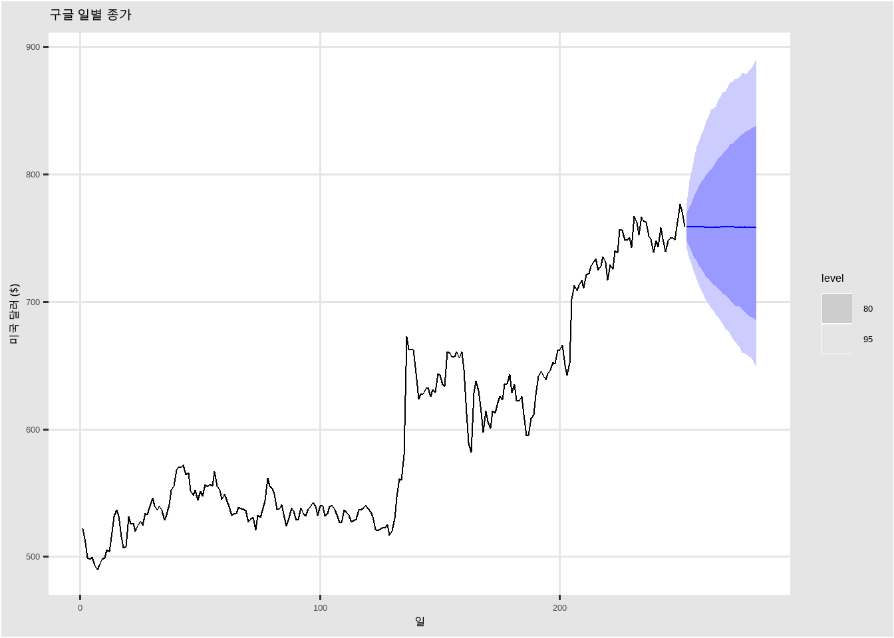
<p class="caption">(\#fig:unnamed-chunk-33)부트스트랩 잔차를 이용한 단순 방법으로 구한 구글 종가분석에 대한 예측값</p>
</div>

표본의 수는 `forecast()` 함수의 `times` 옵션을 사용해서 통제할 수 있다. 예를 들어, 1,000개의 부트스트랩 표본에 기초한 구간은 다음과 같이 표집될 수 있다.


```r
google_2015 %>%
  model(NAIVE(Close)) %>%
  forecast(h = 10, bootstrap = TRUE, times = 1000) %>%
  hilo()
```

```
#> # A tsibble: 10 x 7 [1]
#> # Key:       Symbol, .model [1]
#>    Symbol .model         day        Close .mean                  `80%`
#>    <chr>  <chr>        <dbl>       <dist> <dbl>                 <hilo>
#>  1 GOOG   NAIVE(Close)   253 sample[1000]  759. [748.2394, 769.8420]80
#>  2 GOOG   NAIVE(Close)   254 sample[1000]  760. [742.4161, 776.0701]80
#>  3 GOOG   NAIVE(Close)   255 sample[1000]  759. [738.5428, 778.9668]80
#>  4 GOOG   NAIVE(Close)   256 sample[1000]  759. [736.8174, 783.0048]80
#>  5 GOOG   NAIVE(Close)   257 sample[1000]  759. [732.2708, 785.3428]80
#>  6 GOOG   NAIVE(Close)   258 sample[1000]  759. [730.0741, 789.1724]80
#>  7 GOOG   NAIVE(Close)   259 sample[1000]  759. [727.4674, 792.3645]80
#>  8 GOOG   NAIVE(Close)   260 sample[1000]  759. [723.2158, 795.1217]80
#>  9 GOOG   NAIVE(Close)   261 sample[1000]  759. [721.6219, 798.0486]80
#> 10 GOOG   NAIVE(Close)   262 sample[1000]  759. [719.7830, 800.0148]80
#> # ... with 1 more variable: 95% <hilo>
```

이 경우 산출된 구간은 정규분포에 기초한 예측 구간과 유사하지만 동일하지는 않다.

## 변환을 사용해 예측하기 {#sect5-6}

모델링을 할 때 사용될 수 있는 일반적인 변환은 제[3.1](#sect3-1)에서 논의한 바 있다. 변환을 모델에 포함하여 예측할 때, 먼저 변환된 데이터에 대한 예측값을 산출하게 된다. 그리고 나서, 우리는 원래의 척도로 예측값을 확보하기 위해 변환을 되돌려야 한다 (또는 역변환). 제[3.1](#sect3-1)에서 얘기한 Box-Cox 변환에 대해서 역변환은 다음과 같이 구할 수 있다.

$$
  y_{t} =
    \begin{cases}
      \exp(w_t) & \text{if $\lambda = 0$};\\
      \text{sign}(\lambda w_t+1)|\lambda w_t +1|^{1/\lambda} & \text{otherwise.}\\
    \end{cases}
    (\#eq:eq5-2)
$$

`fable` 패키지는 자동적으로 모델 정의에서 변환이 사용될 때마다 예측값을 역 변환한다. 역변환된 예측 분포는 "변환된 정규" 분포가 된다.

### 변환을 이용하는 예측 구간 {#sect5-6-1}

만약 변환이 사용되었다고 한다면, 예측 구간은 가장 먼저 변환된 척도로 계산되며 종래에는 원 척도로 예측 구간을 제시하기 위해 역변환된다. 이 접근법은 점 예측을 둘러싸고 예측 구간이 대칭적이지는 않게 되지만 예측 구간의 확률 범위를 제시할 수 있는 방법니다.

+ 예를 들어서 로그 변환을 한 결과가 -1부터 +1의 구간이었다면, 이를 원래 척도로 역변환하게 되면 비대칭적 구간이 생긴다.

+ $\log(x) = -1, \log(y) = 1$이라고 할 때, 우리가 얻은 구간이 $[-1, 1]$이라고 하자. 원래의 척도로는 약 [0.37, 2.72]의 구간이 되어 비대칭적이게 된다.

예측 구간에 대한 역 변환은 `fable` 패키지를 사용할 때, 모델 공식에 변환을 사용하였을 경우 자동적으로 수행된다.

변환은 때때로 점 예측치에 대해서는 거의 차이가 없지만 예측 구간에 대해서는 큰 효과를 가진다.

### 편향 조정 (Bias adjustments) {#sect5-6-2}

Box-Cox 변환과 같은 수리적 변환을 사용했을 때의 한 가지 문제점은 역 변환된 점 예측치가 예측 분포의 평균이 아니라는 점이다. 사실, 대개 이 경우 점 예측값은 예측 분포의 중앙값이다 (변환된 분포가 대칭적이라고 가정할 경우). 여러 가지 목적에서 평균이 대체로 선호되지만 이러한 (중앙값을 취하는) 접근법은 택할만하다. 예를 들어, 전체 국가에 대한 예측값을 구하기 위해서 다양한 지역으로부터 매출 예측값을 합산하고자 할 수 있다. 그러나 평균은 더할 수 있는 반면에 중앙값은 더할 수 없다.

Box-Cox 변환에 대해서 역변환된 평균은 다음과 같이 근사치로 주어진다.

$$
\hat{y_{T+h|T}} = 
  \begin{cases} 
    \exp(\hat{w}_{T +h|T}) \left[ 1+\frac{\sigma^{2}_{h}}{2} \right] & \text{if $\lambda = 0$};\\
    (\lambda \hat w_{T+h|T} + 1)^{1/\lambda}\left[ 1+\frac{\sigma^{2}_{h}(1-\lambda)}{2(\lambda\hat{w}_{T+h|\tau} +1)^2}\right] & \text{otherwise;}\\
      \end{cases}
      (\#eq:eq5-3)
$$
여기에서 $\hat w_{T+h|T}$는 $h$-단계의 예측값 평균이며 $\sigma^2_{h}$는 변환된 척도에서의 $h$-단계의 예측값 분산이다. 예측 분산이 커질수록 평균과 중앙값 사이의 차이가 더 커진다.

공식 \@ref(eq:eq5-2)로부터 얻어낸 단순히 역 변환된 예측값과 공식 \@ref(eq:eq5-3)에서 계산된 평균 간의 차이를 **편향(bias)**이라고 부른다. 중앙값보다 평균을 사용한다면, 점 예측값은 **편향 조정된다(bias-adjusted)**.

이 편향 조정이 만들어내는 차이가 얼마나 큰지 살펴보기 위해서는 로그 변환 ($\lambda = 0$)을 사용한 표류 방법으로 계란의 연 평균 가격을 예측하는 다음의 예제를 살펴볼 필요가 있다. 로그 변환은 이 경우 예측값과 예측 구간의 값을 양수로 유지하는 데 유용하다.


```r
prices %>%
  dplyr::filter(!is.na(eggs)) %>%
  model(RW(log(eggs) ~ drift())) %>%
  forecast(h = 50) %>%
  autoplot(prices %>% 
             dplyr::filter(!is.na(eggs)),
           level = 80, point_forecast = lst(mean, median)) +
  labs(title = "연간 계란 가격",
       y = "미국 달러 ($ in cents adjusted for inflation) ")
```

<div class="figure">
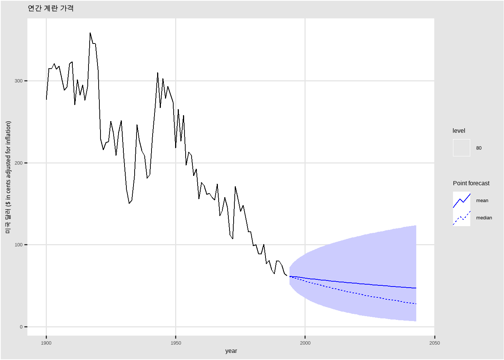
<p class="caption">(\#fig:fig5-17)로그값을 취한 데이터에 적용된 표류 방법을 사용한 계란 가격의 예측값. 편향 조정된 평균 예측값은 실선으로, 중앙값은 점선으로 나타난다.</p>
</div>

Figure \@ref(fig:fig5-17)에서 실선은 예측 평균을 보여주는 반면, 점선은 예측 중앙값을 보여준다. 치우친 예측 분포가 어떻게 예측 분포의 평균을 끌어올리는지를 생각해볼 때, 이는 편향 조정의 결과를 보여준다.

편향 조정된 예측 평균은 자동적으로 `fable` 패키지를 이용해 산출된다. 예측값의 중앙값 (편향 조정 이전의 점 예측값)은 `median()` 함수를 통해 얻을 수 있다.

## 분해(decomposition)를 이용한 예측 {#sect5-7}

제[3](#ch3)장에서 논의된 시계열 분해 는 예측값을 계산하기 위해서 유용한 단계라고 할 수 있다. 

가산 분해를 가정할 때, 분해된 시계열은 다음과 같이 나타낼 수 있다.

$$
y_t = \hat S_t + \hat A_t,
$$

이때, $\hat A_t = \hat T_t + \hat R_t$는 계절성에 따라 조정된 요인이다. 또는 만약 승산 분해(multiplicative decomposition)를 사용했다면 다음과 같이 적을 수 있다.

$$
y_t = \hat S_t \hat A_t
$$

그리고 이때, $\hat A_t = \hat T_t\hat R_t$이다.

분해된 시계열을 예측하기 위해서 계절성 요인인 $\hat S_t$와 계절적으로 조정된 요인인 $\hat A_t$를 따로 예측한다. 대개 계절성 요인은 변화하지 않거나 아니면 극도로 느리게 변화한다고 가정된다. 따라서 단순히 추정된 요인의 마지막 연도의 값을 단순히 취하는 것이 예측값이 된다. 다른 말로, 계절성 단순 방법은 계절성 요인에 대해 사용된다.

계절적으로 조정된 요인을 예측하기 위해 어떠한 비계절적 예측 방법이든 사용될 수도 있다. 예를 들어, 표류 방법, 또는 홀트(Holt) 방법 (제[8](#ch8)장에서 논의할), 또는 비계절성 ARIMA 모델 (제[9](#ch9)장에서 논의할) 등이 사용될 수 있다.

### 예제: 미국 소매 분야의 고용율


```r
us_retail_employment <- us_employment %>%
  dplyr::filter(year(Month) >= 1990, Title == "Retail Trade")

dcmp <- us_retail_employment %>%
  model(STL(Employed ~ trend(window = 7), robust = TRUE)) %>%
  components() %>%
  select(-.model)

dcmp %>%
  model(NAIVE(season_adjust)) %>%
  forecast() %>%
  autoplot(dcmp) +
  labs(y = "인원 수(명)",
       title = "미국 소매 고용") 
```

<div class="figure">
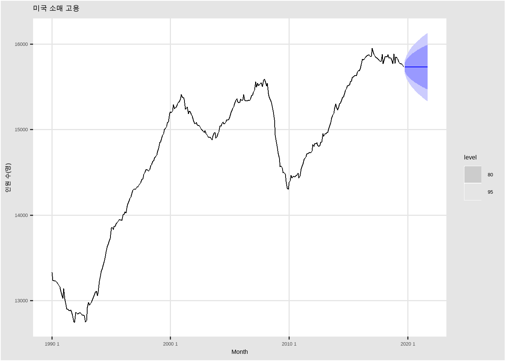
<p class="caption">(\#fig:fig5-18)전미 소매 고용에 대한 STL 분해로부터 얻은 계절적으로 조정된 데이터에 대한 단순 예측값(Naive forecasts)</p>
</div>

Figure \@ref(fig:fig5-18)은 전미 소매 고용율 데이터를 계절적으로 조정한 데 대한 단순 예측값을 보여준다. 이 값들은 계절성 요인에 대한 계절적 단순 예측값을 더함으로써 "재계절화된" 결과라고 할 수 있다.

`decomposition_model()`함수는 각 분해 요인을 예측하기 위한 다른 모델 함수들을 사용하는 가산 분해를 통해서 예측값을 산출할 수 있도록 함으로써 은 이 과정을 쉽게 만들어준다. 모델의 계절성 요인은 만약 서로 다른 모델이 특정되지 않는다면 `SNAIVE()`를 사용하여 자동적으로 예측된다. 이 함수는 또한 원 자료에 대한 예측값 결과를 얻게끔 해주는, "재계절화"도 가능하게 해 준다. Figure \@ref(fig:fig5-19)를 보자.


```r
fit_dcmp <- us_retail_employment %>%
  model(stlf = decomposition_model(
    STL(Employed ~ trend(window = 7), robust = TRUE),
    NAIVE(season_adjust)
  ))
fit_dcmp %>%
  forecast() %>%
  autoplot(us_retail_employment)+
  labs(y = "인원 수(명)",
       title = "미국 소매 고용") 
```

<div class="figure">
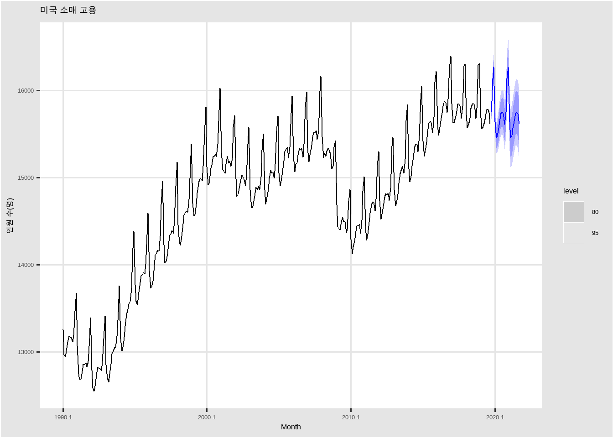
<p class="caption">(\#fig:fig5-19)데이터를 STL 분해한 이후에 계절적으로 조정된 데이터에 대한 단순 예측값과게절적 요인에 대한  계절성 단순 예측값에 기초한 전미 소매 고용에 관한 예측값</p>
</div>

이 그래프에서 나타나는 예측 구간은 점 예측값을 보여주는 것과 동일한 방법으로 계산된다. 즉, 계절적으로 조정된 데이터에 대한 예측 구간의 상한과 하한은 계절적 요인에 대한 예측값을 더함으로써 "재계절화"된다.

Figure \@ref(fig:fig5-20)에서 나타난 잔차의  ASF는 유의미한 자기상관성을 보여준다. 이러한 자기상관성은 계절적으로 조정된 계열에서의 변화하는 추세를 포착해서라기보다는 단순 방법(naïve method) 때문이다.

+ 스터디에서 논의한 바를 정리하자면, Figure \@ref(fig:fig5-18)는 계절성을 고려하지 않은 전체 추세(trend)를 보여주며 예측값을 그 추세의 최종 관측값으로 단순하게 제시하는 단순 분석의 결과를 보여주며, Figure \@ref(fig:fig5-19)는 `decomposition_model()` 함수를 통해 계절성(seasonality)을 분해하여 전체 트렌드에 그 계절성을 더해 계절성 단순 예측을 수행하는 과정을 보여준다고 할 수 있다.


```r
fit_dcmp %>% gg_tsresiduals()
```

<div class="figure">

<p class="caption">(\#fig:fig5-20)잔차 확인하기</p>
</div>

이어지는 장들에서 우리는 단순 방법 대신에 계절적으로 조절된 요인들을 예측하는 데 사용될 수 있는 보다 적절한 방법들을 공부한다.

## 점 예측값의 정확성 평가하기 {#sect5-8}

### 트레이닝과 테스트 세트 {#sect5-8-1}

진짜 예측을 사용해서 예측값의 정확성을 평가하는 것은 중요하다. 결과적으로 잔차의 크기는 얼마나 진정한 예측 오차가 큰지에 대한 신뢰할만한 지표는 아니다. 예측값의 정확성은 모델을 적합할 때 사용되지 않은 새로운 데이터에 대해 모델이 얼마나 잘 설명/예측할 수 있느냐에 따라서만 결정될 수 있다.

모델을 선택할 때, 가장 일반적으로 하는 것은 가용한 데이터를 **트레이닝(training)**과 **테스트(test)** 데이터의 둘로 나누는 것이다.

+ 트레이닝 데이터: 예측 방법에 대한 모수를 추정하는 데 사용된다.

+ 테스트 데이터: (예측 방법과 모델의) 정확성을 평가하는 데 사용된다.

테스트 데이터는 예측에 사용되지는 않기 때문에 모델이 새로운 데이터를 얼마나 잘 예측할 것인지에 대한 신뢰할만한 지표를 제공한다.

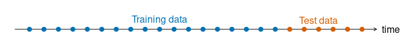

테스트셋의 크기는 일반적으로 전체 표본의 20%에 해당하지만 이 값은 표본의 크기와 얼마나 예측하고자 하는지에 따라 달라진다. 테스트셋은 최소한 요구되는 최대 예측 범위만큼 큰 것이 이상적이다.

+ 트레이닝 데이터를 잘 적합하는 모델이 반드시 예측을 잘 하지는 않는다.

+ 완벽한 모델 적합도는 충분한 수의 모수를 가진 모델을 사용하면 항상 얻을 수 있다.

+ 데이터에 과적합된 모델은 데이터의 체계적 패턴을 식별하는 데 실패하는 것 만큼이나 나쁘다.

테스트셋을 "hold-out set"이라고 하는 것은 이 테스트셋이 적합하는 데 사용된 데이터 이외의 데이터로 구성되기 때문이다. 또 다른 이들은 트레이닝 셋을 "in-sample data"라고 부르기도 하며, 테스트셋을 "out-of-sample data"라고 하기도 한다. 이 책에서는 트레이닝 데이터와 테스트 데이터라고 사용한다.

### 시계열을 서브셋하는 함수 {#sect5-8-2}

`filter()` 함수는 트레이닝과 테스트셋과 같이 대개 시계열의 일부를 추출하는 데 유용하다. 데이터를 평가하기 위한 세트로 분리할 때, 데이터의 인덱스로 필터링하는 것은 특히 유용하다. 예를 들어, 다음의 코드는 1995년부터의 모든 데이터를 추출한다.


```r
aus_production %>% dplyr::filter(year(Quarter) >= 1995)
```

```
#> # A tsibble: 62 x 7 [1Q]
#>    Quarter  Beer Tobacco Bricks Cement Electricity   Gas
#>      <qtr> <dbl>   <dbl>  <dbl>  <dbl>       <dbl> <dbl>
#>  1 1995 Q1   426    4714    430   1626       41768   131
#>  2 1995 Q2   408    3939    457   1703       43686   167
#>  3 1995 Q3   416    6137    417   1733       46022   181
#>  4 1995 Q4   520    4739    370   1545       42800   145
#>  5 1996 Q1   409    4275    310   1526       43661   133
#>  6 1996 Q2   398    5239    358   1593       44707   162
#>  7 1996 Q3   398    6293    379   1706       46326   184
#>  8 1996 Q4   507    5575    369   1699       43346   146
#>  9 1997 Q1   432    4802    330   1511       43938   135
#> 10 1997 Q2   398    5523    390   1785       45828   171
#> # ... with 52 more rows
```

`filter_index()`로도 같은 결과를 얻을 수 있다.


```r
aus_production %>% filter_index("1995 Q1" ~ .)
```

```
#> # A tsibble: 62 x 7 [1Q]
#>    Quarter  Beer Tobacco Bricks Cement Electricity   Gas
#>      <qtr> <dbl>   <dbl>  <dbl>  <dbl>       <dbl> <dbl>
#>  1 1995 Q1   426    4714    430   1626       41768   131
#>  2 1995 Q2   408    3939    457   1703       43686   167
#>  3 1995 Q3   416    6137    417   1733       46022   181
#>  4 1995 Q4   520    4739    370   1545       42800   145
#>  5 1996 Q1   409    4275    310   1526       43661   133
#>  6 1996 Q2   398    5239    358   1593       44707   162
#>  7 1996 Q3   398    6293    379   1706       46326   184
#>  8 1996 Q4   507    5575    369   1699       43346   146
#>  9 1997 Q1   432    4802    330   1511       43938   135
#> 10 1997 Q2   398    5523    390   1785       45828   171
#> # ... with 52 more rows
```

또 다른 유용한 함수는 각 그룹으로부터 서브셋을 선택할 수 있도록 인덱스를 사용하게 하는 `slice()`이다. 예를 들어, 마지막 20개 관측치 (5년치)를 추출해보자.


```r
aus_production %>%
  slice(n()-19:0)
```

```
#> # A tsibble: 20 x 7 [1Q]
#>    Quarter  Beer Tobacco Bricks Cement Electricity   Gas
#>      <qtr> <dbl>   <dbl>  <dbl>  <dbl>       <dbl> <dbl>
#>  1 2005 Q3   408      NA     NA   2340       56043   221
#>  2 2005 Q4   482      NA     NA   2265       54992   180
#>  3 2006 Q1   438      NA     NA   2027       57112   171
#>  4 2006 Q2   386      NA     NA   2278       57157   224
#>  5 2006 Q3   405      NA     NA   2427       58400   233
#>  6 2006 Q4   491      NA     NA   2451       56249   192
#>  7 2007 Q1   427      NA     NA   2140       56244   187
#>  8 2007 Q2   383      NA     NA   2362       55036   234
#>  9 2007 Q3   394      NA     NA   2536       59806   245
#> 10 2007 Q4   473      NA     NA   2562       56411   205
#> 11 2008 Q1   420      NA     NA   2183       59118   194
#> 12 2008 Q2   390      NA     NA   2558       56660   229
#> 13 2008 Q3   410      NA     NA   2612       64067   249
#> 14 2008 Q4   488      NA     NA   2373       59045   203
#> 15 2009 Q1   415      NA     NA   1963       58368   196
#> 16 2009 Q2   398      NA     NA   2160       57471   238
#> 17 2009 Q3   419      NA     NA   2325       58394   252
#> 18 2009 Q4   488      NA     NA   2273       57336   210
#> 19 2010 Q1   414      NA     NA   1904       58309   205
#> 20 2010 Q2   374      NA     NA   2401       58041   236
```

슬라이스는 각각의 키에 대응하는 관측치를 서브셋할 수 있도록 하여 집단에 대해서도 작동한다. 예를 들어, 다음의 코드는 데이터의 각 사계열의 첫 번째 연도별 데이터로 서브셋을 만든다.


```r
aus_retail %>%
  group_by(State, Industry) %>%
  slice(1:12)
```

```
#> # A tsibble: 1,824 x 5 [1M]
#> # Key:       State, Industry [152]
#> # Groups:    State, Industry [152]
#>    State                        Industry            `Series ID`   Month Turnover
#>    <chr>                        <chr>               <chr>         <mth>    <dbl>
#>  1 Australian Capital Territory Cafes, restaurants~ A3349849A    1982 4      4.4
#>  2 Australian Capital Territory Cafes, restaurants~ A3349849A    1982 5      3.4
#>  3 Australian Capital Territory Cafes, restaurants~ A3349849A    1982 6      3.6
#>  4 Australian Capital Territory Cafes, restaurants~ A3349849A    1982 7      4  
#>  5 Australian Capital Territory Cafes, restaurants~ A3349849A    1982 8      3.6
#>  6 Australian Capital Territory Cafes, restaurants~ A3349849A    1982 9      4.2
#>  7 Australian Capital Territory Cafes, restaurants~ A3349849A   1982 10      4.8
#>  8 Australian Capital Territory Cafes, restaurants~ A3349849A   1982 11      5.4
#>  9 Australian Capital Territory Cafes, restaurants~ A3349849A   1982 12      6.9
#> 10 Australian Capital Territory Cafes, restaurants~ A3349849A    1983 1      3.8
#> # ... with 1,814 more rows
```

### 예측 오차 {#sect5-8-3}

예측 오차는 관측값과 예측값 사이의 차이를 말한다. 여기서 "오차"는 실수를 의미하는 것이 아니라 관측치에서 예측할 수 없는 부분을 의미한다. 주어진 트레이닝 데이터 $\{y_1, \dots, y_T\}$와 테스트 데이터 $\{y_{T+1}, y_{T+2}, \dots\}$에서 예측 오차는 다음과 같이 나타낼 수 있다.

$$
e_{T+h} = y_{T+h}-\hat y_{T+h|T},
$$

예측 오차는 잔차와 두 가지 차이가 있다. 첫째, 잔차는 *트레이닝 셋*에 대해서 계산되는 반면에 예측 오차는 *테스트 셋*에 대해서 계산된다. 둘째, 잔차는 *한 단계 예측값*에 기초하지만 예측 오차는 *다단계 예측값*에 따라 계산될 수 있다.

예측 오차를 여러 가지 방법으로 요약함으로써 예측값 정확도를 측정할 수 있다.

### 척도 의존적 오차 (Scale-dependent errors) {#sect5-8-4}

예측 오차는 데이터와 동일한 척도 위에 존재한다. $e_t$에만 기초한 정확도 측정지표는 척도에 의존적이며 서로 다른 단위를 가진 계열 간의 비교에는 사용될 수 없다.

두 가지 가장 흔히 사용되는 척도 의존적 측정지표는 오차의 절대값 또는 제곱합에 기초한다.

$$
\text{Mean absolute error: MAE} = \text{mean}(|e_t|),\\
\text{Root mean squared error: RMSE} = \sqrt{\text{mean}(e^2_t).}
$$

하나의 시계열에 적용된 예측 방법들을 비교하거나 동일한 단위의 여러 시계열에 적용된 예측 방법들을 비교할 때, MAE는 이해가 쉽과 계산이 용이하여 가장 흔히 사용된다. RMSE는 평균에 대한 예측값으로 유도하는 반면에, MAE를 최소화하는 예측 방법은 중앙값에 대한 예측값으로 유도할 것이다. 결과적으로 RMSE는 해석이 어렵기는 하지만 널리 사용된다.

### 백분율 오차 (Percentage errors) {#sect5-8-5}

백분율 오차는 $p_t = 100e_t/y_t$로 나타낼 수 있다. 백분율 오차는 단위에서 자유롭다는 이점이 있기 때문에 데이터셋 간 예측 성과를 비교하는 데 종종 사용된다. 가장 흔하게 사용되는 측정치는 다음과 같다.

$$
 \text{Mean absolute percentage error: MAPE}  = \text{mean}(|p_t|).
$$

백분율 오차에 기초한 측정지표는 무한을 취하거나 만약 연구 대상이 되는 시점 중 어느 시점의 $t$에서 $y_t= 0$이면 정의되지 않는다는 단점이 있다. 그리고 $y_t$가 0에 가까울 경우 극단에 치우친 값을 갖게 되기도 한다. 백분율 오차와 관련되어 종종 간관하는 또 다른 문제점은 백분율 오차가 측정 단위가 유의미한 0을 갖는다고 가정한다는 점이다. 예를 들어, 백분율 오차는 섭씨건 화씨건 온도를 예측하는 정확성을 측정하는 데에는 효용이 없다. 왜냐하면 온도의 0점은 자의적이기 때문이다.

또한 음의 오차에 대해 양의 오차보다 더 큰 패널티를 부과한다는 단점도 있다. 이러한 문제들은 대칭적 MAPE (symmetric MAPE; sMAPE)라고 불리는 방법을 사용하게끔 한다.

$$
\text{sMAPE} = \text{mean}(200|y_t-\hat y_t|/(y_t + \hat y_t)).
$$

하지만 만약 $y_t$가 0에 가깝다면, $\hat y_t$ 또한 0에 가까울 가능성이 크다. 따라서 이 측정지표는 여전히 분수가 0에 가까울 경우 계산이 불안정해지는 문제를 가진다. 또한, sMAPE는 음수값을 취할 수 있기 때문에 "절대값을 취한 백분율 오차"에 대한 측정지표라고 할 수는 없다.

### 스케일링된 오차 (Scaled errors) {#sect5-8-6}

스케일링된 오차는 sMAPE를 사용하지 않을 것을 제안한 Hyndman & Koehler (2006)에 의해서 제안된 백분율 오차의 대안적 방법으로 서로 다른 단위의 계열 간 예측 정확도를 비교하는 데 사용하기 위한 지표이다. 이들은 단순 예측방법으로부터 *트레이닝* MAE에 기초하여 오차를 스케일링할 것을 제안하고 있다.

비계절성을 띈 시계열 자료에 대해서 스케일링된 오차를 정의하는 데 유용한 방법은 단순 예측을 사용하는 것이다.

$$
qj = \frac{e_j}{\frac{1}{T-1}\sum^T_{t=2}|y_t-y_{t-1}|}.
$$

분모와 분자가 모두 원 데이터의 척도의 값과 관련되기 때문에, $q_j$는 데이터의 척도로부터 독립적이다. 만약 트레이닝 데이터에 대해 계산된 평균 한 단계 단순 예측에 비해서 더 나은 예측일 경우, 스케일링된 오차는 1보다 작다. 역으로 예측이 평균 한 단계 단순 예측값보다 안 좋다면 스케일링된 오차는 1보다 크다.

계절적 시계열에 대해서 스케일링된 오차는 계절성 단순 예측을 사용하여 정의할 수 있다.

$$
q_j = \frac{e_j}{\frac{1}{T-m}\sum^{T}_{t=m+1}|y_t-y_{t-m}|}.
$$

평균 절대값 스케일링된 오차는 단순하다:

$$
\text{MASE} = \text{mean}(|q_j|),
$$

마찬가지로 제곱근 평균 스케일링된 오차는 다음과 같이 계산한다.

$$
\text{RMSSE} = \sqrt{\text{mean}(q^2_j)},
$$

그리고 이 때 $q^2_j$는 다음과 같다.

$$
q^2_j = \frac{e^2_j}{\frac{1}{T-m}\sum^{T}_{t=m+1}(y_t-y_{t-m})^2}.
$$

그리고 비 계절성 데이터에 대해서는 $m = 1$로 설정한다.

### 예제 {#sect5-8-7}


```r
recent_production <- aus_production %>%
  dplyr::filter(year(Quarter) >= 1992)
beer_train <- recent_production %>%
  dplyr::filter(year(Quarter) <= 2007)

beer_fit <- beer_train %>%
  model(
    `평균` = MEAN(Beer),
    `단순` = NAIVE(Beer),
    `계절성 단순` = SNAIVE(Beer),
    `표류` = RW(Beer ~ drift())
  )

beer_fc <- beer_fit %>%
  forecast(h = 10)

beer_fc %>%
  autoplot(
    aus_production %>% dplyr::filter(year(Quarter) >= 1992),
    level = NULL
  ) +
  labs(
    y = "단위: 백만 리터", x = "분기",
    title = "분기별 맥주 생산량 예측값"
  ) +
  guides(colour = guide_legend(title = "예측 방법"))
```

<div class="figure">
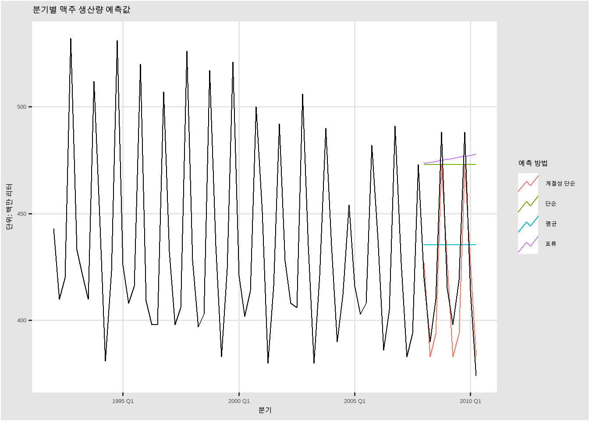
<p class="caption">(\#fig:fig5-21)2007년 말까지의 데이터를 사용한 호주의 분기별 맥주 생산량 예측값</p>
</div>

Figure \@ref(fig:fig5-21)는 2007년도 말까지의 데이터만을 사용한 분기별 호주의 맥주 생산량에 적용된 네 가지 예측 방법을 보여준다. 2008년부터 2010 사이의 실제값도 나타나 있다. 이 기간에 대한 예측 정확도 측정지표를 한 번 계산해보도록 하자.


```r
accuracy(beer_fc, recent_production) %>%
  dplyr::select(.model, RMSE, MAE, MAPE, MASE) %>%
  kableExtra::kbl(
    col.names = c("Methods", "RMSE", "MAE", "MAPE", "MASE")) %>%
  kableExtra::kable_minimal()
```

<table class=" lightable-minimal" style='font-family: "Trebuchet MS", verdana, sans-serif; margin-left: auto; margin-right: auto;'>
 <thead>
  <tr>
   <th style="text-align:left;"> Methods </th>
   <th style="text-align:right;"> RMSE </th>
   <th style="text-align:right;"> MAE </th>
   <th style="text-align:right;"> MAPE </th>
   <th style="text-align:right;"> MASE </th>
  </tr>
 </thead>
<tbody>
  <tr>
   <td style="text-align:left;"> 계절성 단순 </td>
   <td style="text-align:right;"> 14.31084 </td>
   <td style="text-align:right;"> 13.40000 </td>
   <td style="text-align:right;"> 3.168503 </td>
   <td style="text-align:right;"> 0.9370629 </td>
  </tr>
  <tr>
   <td style="text-align:left;"> 단순 </td>
   <td style="text-align:right;"> 62.69290 </td>
   <td style="text-align:right;"> 57.40000 </td>
   <td style="text-align:right;"> 14.184424 </td>
   <td style="text-align:right;"> 4.0139860 </td>
  </tr>
  <tr>
   <td style="text-align:left;"> 평균 </td>
   <td style="text-align:right;"> 38.44724 </td>
   <td style="text-align:right;"> 34.82500 </td>
   <td style="text-align:right;"> 8.283390 </td>
   <td style="text-align:right;"> 2.4353147 </td>
  </tr>
  <tr>
   <td style="text-align:left;"> 표류 </td>
   <td style="text-align:right;"> 64.90129 </td>
   <td style="text-align:right;"> 58.87619 </td>
   <td style="text-align:right;"> 14.577487 </td>
   <td style="text-align:right;"> 4.1172161 </td>
  </tr>
</tbody>
</table>

`accuracy()` 함수는 다양한 정확도 측정지표들과 계산하여 예측값과 맞추기 위하여 자동적으로 데이터로부터 적절한 기간을 추출한다 (이 예제의 경우 `recent_production`).

그래프를 보면 개선될 여지는 남아있지만 계절성 단순 방법이 이 데이터에는 가장 적절하다는 것을 알 수 있다. 종종 서로 다른 정확도 지표들은 어떤 예측 방법이 가장 좋은가에 대해 다른 결과로 이어지곤 한다. 그러나 이 경우, 모든 결과는 계절성 단순 방법이 이 데이터셋에 적용된 네 개의 예측 방법 중 가장 좋은 것이라고 보여주고 있다.

비계절적 예제를 취하기 위해서, 구글 주식 가격을 고려해보자. 다음의 그래프는 2015년부터 세 가지 서로 다른 방법으로부터 얻은 2016년 1월에 대한 종가의 예측값을 보여준다.


```r
google_fit <- google_2015 %>%
  model(
    `평균` = MEAN(Close),
    `단순` = NAIVE(Close),
    `표류` = RW(Close ~ drift())
  )

# 2016년 1월 주식거래일에 대한 예측을 수행한다
google_jan_2016 <- google_stock %>%
  dplyr::filter(yearmonth(Date) == yearmonth("2016 Jan"))

google_fc <- google_fit %>%
  forecast(new_data = google_jan_2016)

google_fc %>%
  autoplot(bind_rows(google_2015, google_jan_2016),
    level = NULL) +
  labs(y = "미국 달러 ($)",
       title = "2015년 1월부터의 구글 주식 종가") +
  guides(colour = guide_legend(title = "예측 방법"))
```

<div class="figure">
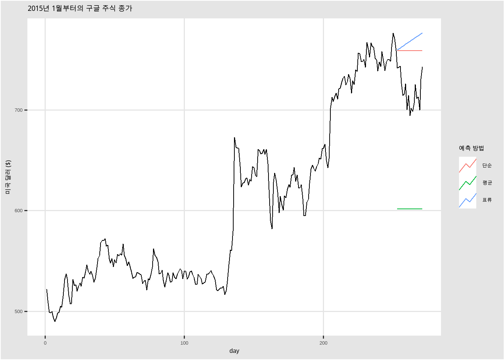
<p class="caption">(\#fig:fig5-8)2016년 1월에 대한 구글 주가의 예측값</p>
</div>


```r
accuracy(google_fc, google_stock) %>%
  dplyr::select(.model, RMSE, MAE, MAPE, MASE) %>%
  kableExtra::kbl(
    col.names = c("Methods", "RMSE", "MAE", "MAPE", "MASE")) %>%
  kableExtra::kable_minimal()
```

<table class=" lightable-minimal" style='font-family: "Trebuchet MS", verdana, sans-serif; margin-left: auto; margin-right: auto;'>
 <thead>
  <tr>
   <th style="text-align:left;"> Methods </th>
   <th style="text-align:right;"> RMSE </th>
   <th style="text-align:right;"> MAE </th>
   <th style="text-align:right;"> MAPE </th>
   <th style="text-align:right;"> MASE </th>
  </tr>
 </thead>
<tbody>
  <tr>
   <td style="text-align:left;"> 단순 </td>
   <td style="text-align:right;"> 43.43152 </td>
   <td style="text-align:right;"> 40.38421 </td>
   <td style="text-align:right;"> 5.672675 </td>
   <td style="text-align:right;"> 5.665586 </td>
  </tr>
  <tr>
   <td style="text-align:left;"> 평균 </td>
   <td style="text-align:right;"> 118.03221 </td>
   <td style="text-align:right;"> 116.94524 </td>
   <td style="text-align:right;"> 16.235169 </td>
   <td style="text-align:right;"> 16.406495 </td>
  </tr>
  <tr>
   <td style="text-align:left;"> 표류 </td>
   <td style="text-align:right;"> 53.06958 </td>
   <td style="text-align:right;"> 49.82414 </td>
   <td style="text-align:right;"> 6.992133 </td>
   <td style="text-align:right;"> 6.989934 </td>
  </tr>
</tbody>
</table>

여기에서 가장 좋은 방법은 어떤 정확도 측정지표가 사용되었는냐와 무관하게 단순 방법이다.

## 예측 분포의 정확도 평가하기 {#sect5-9}

이후에 이어지는 모든 측정지표들은 점 예측값의 정확도를 측정하기 위한 것이다. 예측 분포를 평가할 때, 우리는 몇 가지 서로 다른 지표들을 이용해야만 한다.

### 분위 지표 {#sect5-9-1}

구글 주가 예제를 다시 한 번 생각해보자. Figure \@ref(fig:fig5-23)은 단순 방법을 통한 예측값의 80% 예측 구간을 보여준다.


```r
google_fc %>%
  dplyr::filter(.model == "단순") %>%
  autoplot(bind_rows(google_2015, google_jan_2016), level = 80)+
  labs(y = "미국 달러 ($)",
       title = "구글 종가") 
```

<div class="figure">
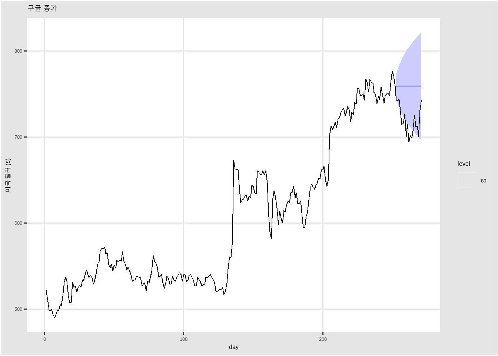
<p class="caption">(\#fig:fig5-23)80% 예측구간으로 구한 2016년 1월 구글 주가의 단순 예측값</p>
</div>

보다 일반적으로 우리는 미래 시점 $t$에서의 확률 $p$의 확률을 가지고 분위 예측을 하는 것에 관심을 가진다. 그리고 이를 $f_{p,t}$로 표기한다. 즉, 우리는 관측값 $y_t$이 확률 $p$의 $f_{p,t}$보다 작을 것이라고 기대한다. 예를 들어, 10번째 백분위는 $f_{0,10, t}$가 된다. 만약 $y_t$가 $t$ 시점에서의 관측치를 의미한다면, 분위 지수는 다음과 같다:

$$
Q_{p,t} = 
  \begin{cases}
  2(1-p)(f_{p,t}-y_t), & \text{if } y_t < f_{p,t}\\
  2p(y_t - f_{p,t}), & \text{if } y_t \geq f_{p,t}
  \end{cases}
$$

이는 종종 핀볼 손실함수(pinball loss function)라고도 불린다. 왜냐하면 그래프가 핀볼 테이블의 볼의 궤적을 닯았기 때문이다. 위의 공식에서 승수 2는 종종 생략되고는 하지만, 포함할 경우 해석이 좀 더 용이하다. $Q_{p,t}$가 낮은 값이라는 것은 분위에 대한 더 좋은 추정치라는 것을 의미한다.

분위 지수는 절대 오차와 같이 해석될 수도 있다. $p=0.5$일 때, 분위 지수인 $Q_{0.5, t}$는 절대 오차와 같다. 다른 $p$ 값에 대해서는 오차인 ($y_t - f_{p,t}$)에 얼마나 그 값이 양수일지 음수일지를 설명하도록 가중치를 부가한다. 만약 $p > 0.5, Q_{p, t}$일 경우에는 관측치가 추정된 분위보다 더 클 때, 추정된 분위보다 더 작은 경우에 비하여 더 큰 패널티가 부과된다. 

Figure \@ref(fig:fig5-23)에서 한 단계의 10% 분위 예측 (2015년 1월 4일)은 $f_{0.1, t}=744.54$이며, 관측된 값은 $y_t = 741.84$가 된다.

$$
Q_{0.1, t} = 2(1-0.1)(744.54 − 741.84) = 4.86.
$$

이는 간단히 `accuracy()` 함수와 `quantile_score()` 함수를 이용해서 계산할 수 있다.


```r
google_fc %>%
  dplyr::filter(.model == "단순", Date == "2016-01-04") %>%
  accuracy(google_stock, list(qs=quantile_score), probs=0.10)
```

```
#> # A tibble: 1 x 4
#>   .model Symbol .type    qs
#>   <chr>  <chr>  <chr> <dbl>
#> 1 단순   GOOG   Test   4.86
```


### Winkler 지수

예측 구간을 평가하는 것이 관심하일 때에는 Winkler 지수가 좋은 선택일 수 있다. 만약 $100(1-\alpha)$%의 $t$ 시점에서의 예측구간이 $[\ell_{\alpha, t}, u_{\alpha, t}]$라고 한다면, Winkler 지수는 관측찺이 구간 밖에 있다면 구간의 길이에 패널티를 더함으로써 정의된다.

$$
W_{\alpha, t} = 
  \begin{cases}
    (u_{\alpha, t} - \ell_{\alpha, t}) + \frac{2}{\alpha}(\ell_{\alpha, t} - y_t) & \text{if }y_t < \ell_{\alpha, t}\\
    (u_{\alpha, t} - \ell_{\alpha, t})& \text{if } \ell_{\alpha, t}\leq y_t \leq u_{\alpha, t} \\
    (u_{\alpha, t} - \ell_{\alpha, t})  + \frac{2}{\alpha}(y_t - u_{\alpha, t}) & \text{if }y_t > u_{\alpha, t}\\
  \end{cases}
$$

구간 내에 떨어지는 관측치들에 대해서 Winkler 지수는 단순히 구간의 길이를 보여준다. 따라서 낮은 지수값은 좁은 구간과 관련되어 있다. 하지만 만약 관측치가 구간 밖에 떨어질 경우, 패널티가 적용되어 구간 밖에 얼마나 멀리 떨어져 있는지에 대한 패널티 비율이 더해지게 된다.

예측 구간은 대개 $\ell_{\alpha, t} = f_{\alpha/2,t}$와 $u_{\alpha, t} = f_{1-\alpha/2, t}$를 설정함으로서 분위로부터 계산될 수 있다. 대응하는 분위 지수와 $\alpha$로 나눔으로써 다음과 같은 Winkler  지수를 계산할 수 있다.

$$
W_{\alpha, t} = (Q_{\alpha/2,t} + Q_{1-\alpha/2, t})/\alpha.
$$

Figure \@ref(fig:fig5-23)에서 2016 1월 4일에 대한 나타난 한 단계 80% 예측 구간은 [744.54, 773.22]이며, 실제 값은 741.84이므로, Winkler 지수는 다음과 같다.

$$
W_{\alpha, t} = (773.22 − 744.54) + \frac{2}{0.2}(744.54 − 741.84) = 55.68.
$$

마찬가지로 `winkler_score()`와 `accuracy()`를 통해 쉽게 계산할 수 있다.


```r
google_fc %>%
  dplyr::filter(.model == "단순", Date == "2016-01-04") %>%
  accuracy(google_stock,
    list(winkler = winkler_score), level = 80)
```

```
#> # A tibble: 1 x 4
#>   .model Symbol .type winkler
#>   <chr>  <chr>  <chr>   <dbl>
#> 1 단순   GOOG   Test     55.7
```

### Continuous Ranked Probability Score

전체 예측 분포에 대해 알고 싶을 때 **연속 순위 확률 지수** 또는 CRPS를 얻기 위해 $p$의 모든 값에 대해 분위 지수의 평균을 구할 수도 있다.

구글 주가 예제에서 우리는 평균 CRPS 값을 테스트셋의 모든 일자에 대해서 계산할 수 있다. CRPS 값은 가중치가 $p$ 확률에 대해 설명할 때, 전체 예측 분포로부터 계산된 가중치가 부여된 절대 오차와 거의 같다.


```r
google_fc %>%
  accuracy(google_stock, list(crps = CRPS))
```

```
#> # A tibble: 3 x 4
#>   .model Symbol .type  crps
#>   <chr>  <chr>  <chr> <dbl>
#> 1 단순   GOOG   Test   26.5
#> 2 평균   GOOG   Test   76.7
#> 3 표류   GOOG   Test   33.5
```

### Scale-free comparisons using skill scores

점 예측값을 가지고 서로 다른 척도의 시계열에 대한 여러 방법의 예측 분포의 정확도를 비교할 수 있다면 유용할 것이다. 점 예측값에 대해서 우리는 스케일링된 오차를 사용할 수 있다. 또 다른 방법은 스킬 지수를 사용하는 것이다. 이는 점 예측값 정확도나 예측 분포 정확도 모두에 사용될 수 있다.

스킬 지수를 가지고 있을 때, 우리는 몇몇 벤치마크 방법에 비한 예측 정확도 지표를 계산할 수 있다. 예를 들어, 만약 벤치마크 모델로 단순 방법을 사용하고 표류 방법을 사용하여 예측값을 계산했다고 한다면 우리는 단순 방법에 비해 표류 방법에 대한 CRPS 스킬 지수를 계산할 수 있다.

$$
\frac{\text{CRPS}_\text{Naïve} - \text{CRPS}_\text{Drift}}{\text{CRPS}_\text{Naïve}}.
$$

이는 CRPS에 기초하여 단순 방법에 비해 표류 방법이 얼마나 더 (몇 %) 정확도를 개선하는가를 보여준다. `accuracy()`로 계산할 수 있다.


```r
google_fc %>%
  accuracy(google_stock, list(skill = skill_score(CRPS)))
```

```
#> # A tibble: 3 x 4
#>   .model Symbol .type  skill
#>   <chr>  <chr>  <chr>  <dbl>
#> 1 단순   GOOG   Test   0    
#> 2 평균   GOOG   Test  -1.90 
#> 3 표류   GOOG   Test  -0.266
```

단순 방법이 기준이기 때문에 여기서 단순 방법에 대한 스킬 지수 값은 0이다. 왜냐하면 기준인 단순 방법을 그 자체로 개선할 수는 없기 때문이다. 다른 두 방법은 단순 방법보다 CRPS 값보다 음수로 더 큰 값을 가진다. 예를 들어, 표류 방법은 단순 방법에 비해서 26.6% 정도 더 안좋은 방법이라고 할 수 있다.

`skill_score()` 함수는 `fable` 객체에 포함하지는 않지만 항상 적절한 벤치마크할 예측값에 대한 CRPS를 계산할 것이다. 데이터가 계절성을 띌 때, 단순 방법보다는 계절성 단순 방법이 벤치마크 방법으로 사용된다. 벤치마크 예측값에 대해 동일한 트레이닝 데이터가 사용된다는 것을 확신하기 위해서, `accuracy()` 함수에 제공되는 데이터는 트레이닝 데이터와 동일한 시점에서 시작되어야 한다는 것이 중요하다.

`skill_score()` 함수는 어떤 정확도 측정지표에서도 사용될 수 있다. 예를 들면, `skill_score(MSE)`는 다른 계열들 간 MSE 값을 비교하여 보옂루 것이다. 그러나 중요한 것은 테스트 셋이 오차 측정지표에 대한 신뢰할만한 계산 결과들을 제공할만큼 충분히 큰 지를 확인하는 것이다. 이러한 이유에서 MASE 또는 RMSSE는 종종 선호할만한 점 예측값 정확도에 대한 척도로부터 자유로운 측정지표가 된다.

## 시계열 교차 타당화 {#sect5-10}

트레이닝/테스트 셋에 대한 보다 복잡한 방법은 시계열 교차 타당화이다. 이 방법에서는 여러 개의 테스트셋이 있고 각각은 하나의 관측치로 이루어져 있다. 각 테스트 셋에 대응하는 트레이닝 셋은 테스트셋을 구성하는 관측치 바로 직전에 발생한 관측치로 이루어진다. 따라서 예측값을 구성하는 데 어떠한 미래의 값도 사용될 수 없다. 작은 규모의 트레이닝 셋에 기초해서는 신뢰할만한 예측값을 얻을 수 없기 때문에, 가장 최초의 관측치는 테스트셋으로 간주되지 않는다.

다음의 그림은 파란 색은 관측치는 트레이닝셋, 그리고 오렌지 색은 테스트셋을 의미하는 일련의 트레이닝셋과 테스트 셋을 보여준다.

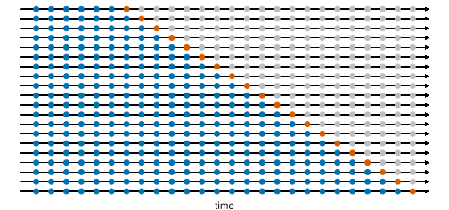

예측 정확도(forecast accuracy)는 테스트(test) 데이터에 대한 평균으로 계산한다. 예측하는 원점(origin)을 시간에 따라 앞으로 굴리기 때문에 때때로 이 과정을 “예측 원점 굴리기에 대한 평가(evaluation on a rolling forecasting origin)”라고도 한다.

시계열 예측에서, 한 단계 예측치는 여러 단계 예측치와 그렇게 관련이 있지 않을 수도 있다. 이런 경우에는, 예측 원점 굴리기(rolling forecasting origin)에 기초한 교차 검증(cross-validation) 과정을 여러 단계 오차(multi-step forecast)를 사용할 수 있도록 수정할 수 있다. 4단계 앞 예측치를 잘 내는 모델에 관심이 있다고 하자. 그러면 대응되는 그래프는 아래와 같다.

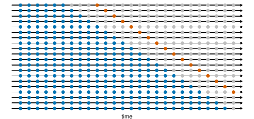


다음 예제에서 우리는 잔차 정확성을 가지고 시계열 교차 타당화로 얻어낸 정확도를 비교한다. `stretch_tsibble()` 함수는 수많은 트레이닝 셋들을 만드는 데 사용된다. 이 예제에서 트레이닝셋의 길이는 `.init = 3`에서 시작하며, 이어지는 트레이닝셋의 크기는 `.step = 1`로 증가한다.


```r
# 시계열 교차 타당성 정확도
google_2015_tr <- google_2015 %>%
  stretch_tsibble(.init = 3, .step = 1) %>%
  relocate(Date, Symbol, .id)
google_2015_tr
```

```
#> # A tsibble: 31,875 x 10 [1]
#> # Key:       Symbol, .id [250]
#>    Date       Symbol   .id  Open  High   Low Close Adj_Close  Volume   day
#>    <date>     <chr>  <int> <dbl> <dbl> <dbl> <dbl>     <dbl>   <dbl> <int>
#>  1 2015-01-02 GOOG       1  526.  528.  521.  522.      522. 1447600     1
#>  2 2015-01-05 GOOG       1  520.  521.  510.  511.      511. 2059800     2
#>  3 2015-01-06 GOOG       1  512.  513.  498.  499.      499. 2899900     3
#>  4 2015-01-02 GOOG       2  526.  528.  521.  522.      522. 1447600     1
#>  5 2015-01-05 GOOG       2  520.  521.  510.  511.      511. 2059800     2
#>  6 2015-01-06 GOOG       2  512.  513.  498.  499.      499. 2899900     3
#>  7 2015-01-07 GOOG       2  504.  504.  497.  498.      498. 2065100     4
#>  8 2015-01-02 GOOG       3  526.  528.  521.  522.      522. 1447600     1
#>  9 2015-01-05 GOOG       3  520.  521.  510.  511.      511. 2059800     2
#> 10 2015-01-06 GOOG       3  512.  513.  498.  499.      499. 2899900     3
#> # ... with 31,865 more rows
```

`.id` 열은 서로 다른 트레이닝 셋을 나타내는 새로운 키 이며, `accuracy()` 함수는 서로 다른 트레이닝셋 간 예측값 정확도를 평가하는 데 사용될 수 있다.


```r
bind_rows(
# TSCV accuracy
google_2015_tr %>%
  model(RW(Close ~ drift())) %>%
  forecast(h = 1) %>%
  accuracy(google_2015) %>%
  mutate(.type = "Cross-validation"),

# Training set accuracy
google_2015 %>%
  model(RW(Close ~ drift())) %>%
  accuracy()  %>%
  mutate(.type = "Training")
) %>% 
  mutate_if(is.numeric, round, 2) %>%
  dplyr::select(.type, RMSE, MAE, MAPE, MASE) %>%
  kableExtra::kbl(
    col.names = c("Evaluation method", "RMSE", "MAE", "MAPE", "MASE")) %>%
  kableExtra::kable_minimal()
```

<table class=" lightable-minimal" style='font-family: "Trebuchet MS", verdana, sans-serif; margin-left: auto; margin-right: auto;'>
 <thead>
  <tr>
   <th style="text-align:left;"> Evaluation method </th>
   <th style="text-align:right;"> RMSE </th>
   <th style="text-align:right;"> MAE </th>
   <th style="text-align:right;"> MAPE </th>
   <th style="text-align:right;"> MASE </th>
  </tr>
 </thead>
<tbody>
  <tr>
   <td style="text-align:left;"> Cross-validation </td>
   <td style="text-align:right;"> 11.27 </td>
   <td style="text-align:right;"> 7.26 </td>
   <td style="text-align:right;"> 1.19 </td>
   <td style="text-align:right;"> 1.02 </td>
  </tr>
  <tr>
   <td style="text-align:left;"> Training </td>
   <td style="text-align:right;"> 11.15 </td>
   <td style="text-align:right;"> 7.16 </td>
   <td style="text-align:right;"> 1.18 </td>
   <td style="text-align:right;"> 1.00 </td>
  </tr>
</tbody>
</table>

기대한 바와 같이 잔차로부터 얻은 정확도 측정지표는 더 작고, 그에 대응하는 예측값들은 진정한 예측값이라기 보다는 전체 데이터 셋에 적합된 모델에 기초한 것이다.

최선의 예측 모델을 선택하는 좋은 방법은 시계열 교차 타당화를 이용하여 계산된 가장 작은 RMSE를 갖는 모델을 찾는 것이다.

### 예제: 교차 타당화를 이용한 예측 범위 정확도

Figure \@ref(fig:fig5-9)에서 그래프로 보여준 `gafa_stock` 데이터의 서브셋인 `google_2015`는 구글의 일별 종가를 2015년도 거래일에 대한 나스닥 환율로 보여주고 있다.

아래의 코드는 표류 예측값을 1단계부터 8단계까지 예측한 성과를 평가하고자 하는 것이다. 그래프는 예측 범위가 증가할수록 예측 오차가 증가한다는 것을 보여준다.


```r
google_2015_tr <- google_2015 %>%
  stretch_tsibble(.init = 3, .step = 1)

fc <- google_2015_tr %>%
  model(RW(Close ~ drift())) %>%
  forecast(h = 8) %>%
  group_by(.id) %>%
  mutate(h = row_number()) %>%
  ungroup() %>%
  as_fable(response = "Close", distribution = Close)

fc %>%
  accuracy(google_2015, by = c("h", ".model")) %>%
  ggplot(aes(x = h, y = RMSE)) +
  geom_point() 
```

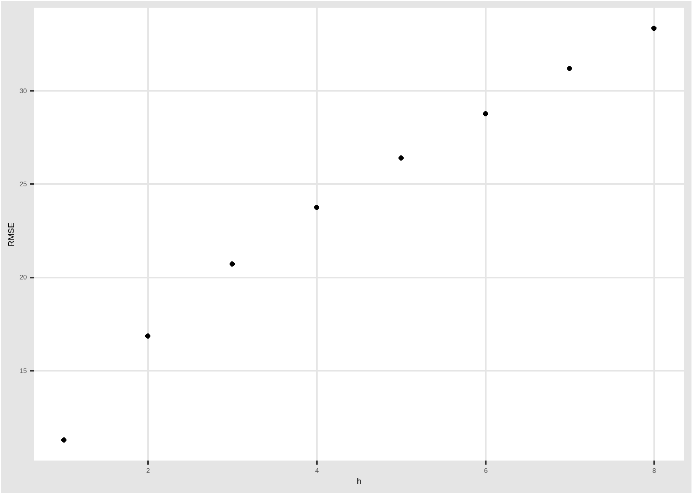
